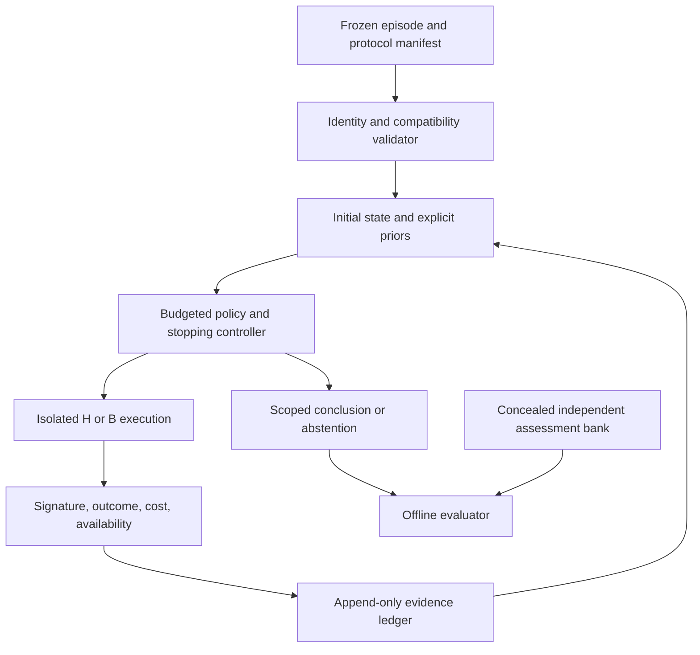

# Minimal research program: adaptive CI investigation

- **Date:** 2026-09-05.
- **Status:** Proposed design; no prototype implemented and no experiment run under this protocol.
- **Repository baseline:** `d967dbaaec257613c3e1f2440866801c71d0c00e` (`research/revival-2026`).
- **Purpose:** Define the smallest executable study connecting change-aware test prioritization to choosing the next CI observation.
- **Scope:** One already-failing test, two verified revisions, one controlled execution protocol, two execution actions, bounded investigation, and abstention. No release decision or general root-cause diagnosis.
- **Audience:** A researcher or agent continuing the project without access to the originating conversation.
- **Authority:** This document proposes a program; it does not retroactively establish results or supersede the existing research records.

## 1. Recommendation and reading contract

**Proposal.** Start with this question:

> After an index CI failure, can an outcome-adaptive allocation of a small execution budget between the changed revision and a verified pre-change reference estimate differential reproducibility better than strong fixed allocations?

The observable is recurrence of the **same failure signature**. The first study concerns controlled differential reproducibility, not whether a revision is safe, whether a failure is inherently flaky, or which source line caused a defect.

**Proposal.** Version 1 is a deterministic execution harness plus a small probabilistic selector. Its actions are `RUN_HEAD`, `RUN_REFERENCE`, and `STOP`. It has no LLM, test generation, repair, deployment authority, or multi-agent coordination. The first comparison must determine whether adaptation adds value over alternating or allocating executions cheaply.

**Inference.** This is a smaller and less novel problem than a general CI investigator. That is intentional: an executable benchmark and a demonstrated need for adaptive allocation are prerequisites, not proof that an agentic platform is worthwhile.

### Statement labels

- **Established evidence:** Inspected repository behavior, archived output, or a fact supported by a cited primary source. A verified *report of a result* is distinguished from an independently reproduced result.
- **Inference:** Interpretation of that evidence, not an experimental finding.
- **Proposal:** A design choice, planned procedure, or numerical gate not yet validated.
- **Open question:** Information that must be resolved before making the corresponding claim.

All numerical settings below are **Proposal** defaults. Freeze them after the development feasibility stage, before opening held-out outcomes. Record any change as a new protocol version with its reason; do not silently tune on test results.

### Next authorized research step when execution is requested

**Proposal.** Perform Gate 0: inspect a bounded candidate-artifact roster and qualify six authentic head/reference test pairs. Record ancestry, test compatibility, environment construction, target command, and acquisition failures. Do not begin by training a model or downloading all LRTS data. This document itself authorizes no execution or infrastructure changes.

## 2. Evidence basis and boundaries

### 2.1 Repository evidence

**Established evidence.** The research-state, trajectory, experiment, and decision documents were read at the baseline above. They remain scaffolds rather than populated experiment registries: [RESEARCH_STATE.md](RESEARCH_STATE.md), [TRAJECTORY.md](TRAJECTORY.md), [EXPERIMENTS.md](EXPERIMENTS.md), and [DECISIONS.md](DECISIONS.md). The substantive earlier narrative is [change-aware-tcp-findings-2026-08.md](change-aware-tcp-findings-2026-08.md).

| Evidence anchor | Established evidence | Consequence for this design |
|---|---|---|
| `61cb1cc`, legacy framework and outputs | Historical features, neural classifiers, and embedding experiments precede the newer pipeline. | Reuse concepts selectively; legacy headline metrics are not evidence for interactive diagnosis. |
| `557e47f`, Airavata Step 2 | Archived history-model per-cycle APFD is 0.7873 versus optimum 0.7897 on its evaluated tail. | Recurring failures can consume much of a ranking objective. |
| `25eb6b7`, Airavata Step 3 | Archived per-cycle output yields HIST 0.823745 versus HIST+T0 0.817645 on 30 small-failure cycles; this aggregate was independently recomputed during the repository audit. Larger small-failure cycles still had headroom. | Preserve the negative result; do not assume headroom alone predicts useful additional evidence. |
| `820647e`, pipeline import | Imports the nine current pipeline modules; its message cites source commit `265a0b8`, which is unavailable among inspected Git objects. | Implementation exists, but provenance is incomplete. |
| `fd36568`, consolidated findings | Reports HBase/Hive persistence-APFD improvements; raw supporting outputs were not found at documented locations. | Motivation only until reconstructed, not ground truth for the new study. |
| `pipeline/step3_regapfd.py::regression_labels` | Labels a failure when the next execution of the same name also fails. | This is a persistence proxy, not a causal regression oracle. |
| `pipeline/lrts_adapter.py::build_enhanced_dataset` | Copies observed execution duration into `Duration`. | Future-action costs need prior estimates; current completed observations can legitimately supply costs. |
| `pipeline/relevance_t0.py::compute_t0_column` | Fits its vocabulary/IDF over all supplied identities and changed paths. | Any future reuse must fit only causally available inputs. |

**Established evidence.** Local Airavata CSVs exist under `datasets/apache@airavata/`. Raw counts inspected during the audit were 11,484 executions, 55 test identities, and 236 executed builds. Fifty builds had 21 failures. Those tables do not contain results of arbitrary repeat executions or controlled revision comparisons.

**Established evidence.** The current schema lacks the verified external name-map integration present on the older Airavata branch. The claimed 39 adapter tests and listed scratchpad analyses were not located in the current tracked tree. `C:/h` and `C:/long_running_test_suites` were absent on this machine. No current executable-container inventory was verified. These are availability findings, not assertions that recovery is impossible.

**Established evidence.** Trace MCP was used for symbol/context lookup and usages. In particular, `compute_t0_column` feeds the ordinary and persistence evaluators. Consequential source claims were checked against filesystem code; indexed snippets are navigation aids, not experimental evidence.

Historical evidence can be inspected without changing branches:

```powershell
git show 25eb6b7:FINAL6/apache@airavata/step3_report.json
git show 557e47f:FINAL6/apache@airavata/step2_report.json
git show origin/claude/t0-path-token-relevance-f13581:BugSwarm/step0_viability_report.txt
git diff origin/claude/t0-path-token-relevance-f13581 HEAD -- FINAL6/TCP-CI_schema.py
```

### 2.2 Prior art and the allowable novelty claim

**Established evidence.** Sequential diagnostic test selection already exists: [SEQUOIA, Spectrum-Based Sequential Diagnosis](https://ojs.aaai.org/index.php/AAAI/article/view/7844) uses diagnostic information gain. [Google's Flake Aware Culprit Finding](https://research.google/pubs/flake-aware-culprit-finding/) uses probabilistic reasoning to locate suspect revisions despite noisy test outcomes. Merely choosing an informative rerun with a Bayesian model is not a new contribution.

**Inference.** The immediate contribution could be an openly reproducible evaluation of when adaptive allocation earns its cost, including a negative result. Heterogeneous diagnostic tools, stopping under model misspecification, and learning across CI episodes are later novelty candidates requiring separate literature comparisons. Do not claim general root-cause or release-assurance advances from this two-action pilot.

## 3. Estimand, assumptions, and hypothesis space

### 3.1 Exact target

**Proposal.** An episode is one selected index failure, its test identity, changed revision `H`, verified pre-change reference `B`, normalized index signature `s`, and a fixed execution protocol `E`.

Define:

- `p_H = P(signature s recurs | execute target at H under E)`.
- `p_B = P(signature s recurs | execute target at B under E)`.
- `Delta = p_H - p_B`.

The primary estimation task concerns both probabilities. A secondary decision concerns a **large increase**, defined initially as `Delta >= 0.30`. This deliberately coarse threshold makes a small-budget pilot plausible. It is not a universal engineering tolerance; changes of less than 0.30 can still matter. Secondary sensitivity analyses at 0.20 and 0.40 do not replace the primary threshold.

**Proposal.** The system may report:

1. `LARGE_INCREASE_SUPPORTED`: evidence favors `Delta >= 0.30` under E; recommend examining the H-versus-B change.
2. `BELOW_LARGE_INCREASE_SUPPORTED`: evidence favors `Delta < 0.30` under E; this does not establish no regression, harmlessness, or release safety.
3. `INSUFFICIENT_EVIDENCE`: remaining uncertainty, unavailable observations, budget exhaustion, or a failed comparability assumption.

### 3.2 Beliefs rather than exclusive causal labels

**Proposal.** Maintain independent `Beta(alpha_H, beta_H)` and `Beta(alpha_B, beta_B)` working beliefs, initially `Beta(1,1)` each. Independence and exchangeable executions are modeling assumptions, not facts about CI.

This accommodates head-only recurrence, recurrence on both revisions, and intermittence on either revision. A change-associated increase and intermittent behavior can coexist. Environment effects, shared dependency defects, and exact causal mechanisms remain structured unresolved explanations, not classes the pilot pretends to distinguish.

**Proposal.** The index failure selects the episode. Do not count that selected failure as an unbiased random head trial in the Beta update. Newly requested, valid executions supply the likelihood. Historical outcomes across different revisions are descriptive context in v1, not direct samples from `p_H` or `p_B`.

### 3.3 Assumptions to qualify and disclose

**Proposal.** Qualification requires the same executable test definition and declared fixtures on H and B, fresh execution state, comparable toolchain and dependency policy, and a resolvable pre-change relationship. The first cohort uses non-merge H commits with B equal to the verified immediate parent. PR virtual merges and ambiguous multi-parent histories are deferred.

**Open question.** Can enough historical artifacts meet those requirements without modifying the tested behavior? Changes to test definitions or incompatible dependency requirements may prevent qualification. A compilation failure is not an observation of the target test.

**Inference.** Holding E fixed improves internal validity but restricts the claim to that experimental protocol. It may not recreate the original historical CI environment exactly. Record every reconstruction or patch; behavior-changing repairs disqualify a case from the primary cohort.

## 4. Minimal decision state and causal boundary

**Proposal.** The state is `S = (episode manifest, index observation, action ledger, H/B counts, predicted costs, remaining budget, comparability flags)`. The following is exhaustive for v1; there is no learned embedding or hidden whole-project context.

| Layer | Minimal contents | Existing support / required work |
|---|---|---|
| Raw identity | Project, H/B SHAs, ancestry evidence, target test and command, test-source hash, E manifest hash | Git and existing name-join concepts help; executable manifests are new. |
| Raw index observation | Original signature, raw log reference, completed result, duration, availability time | Some historical logs may be recoverable; CSV verdicts alone are insufficient. |
| Raw action history | Requested action, result, signature, cost, environment, start/end/available times | New append-only ledger required. |
| Derived sufficient statistics | Per revision, valid matching failures and valid passes observed during this investigation | Small new counter/updater; do not reuse F-to-F labels. |
| Derived costs | Predicted cold/warm execution cost and remaining action/wall/compute budgets | Initial completed head cost is now causally available; reference estimate comes from a disclosed setup calibration or development default, without revealing its outcome. |
| Beliefs | Posterior means, uncertainty, `P(Delta >= 0.30)`, model-validity flags | New explicit statistical model. |
| Optional descriptive context | Prior completed outcomes/durations and matching known symptoms, with provenance/missingness | Existing historical feature logic can be adapted; omit when unavailable. Not required for the core policy. |

**Proposal.** The base-to-head changed-file list is stored for provenance and future analysis. Changed symbols, dependency graphs, T0 scores, historical episode embeddings, and environmental search are not selection inputs in v1. There is only one target test, so conventional TCP does not directly solve this allocation problem.

**Proposal.** Unavailable information includes future passing/fix revisions, later issue explanations, adjudication outcomes, unrequested action-bank results, actual durations of future actions, future vocabulary, and results from builds that had not completed. Record both historical event time and experimental availability time. During replay, release an observation only after the simulated action completes, even though the evaluator physically holds the full bank.

**Inference.** The duration of the completed index failure is legitimate here because the decision follows that failure. This differs from using the current execution's duration to prioritize it before it ran.

## 5. Actions and observations

### 5.1 First action space

**Proposal.** Each execution is a fresh isolated invocation of the same target test; one action does not silently include several retries.

| Action | Required inputs | Charged cost | Output / uncertainty addressed | Static CSV simulation? | Executable artifact? |
|---|---|---|---|---|---|
| `RUN_HEAD` | H, target, E, fresh-state recipe | Restore/setup if needed, execution, log parsing, allocated CPU and wall time | Matching recurrence or pass; estimates reproducibility at H | No: next-cycle outcomes are not same-revision reruns | Yes |
| `RUN_REFERENCE` | Verified B and same compatible target/E | Reference build/restore, execution, parsing; usually a different startup cost | Whether the same symptom occurs before the change; informs Delta | No: a prior CI row is not a controlled counterfactual execution | Yes, including reconstructable B |
| `STOP` | Current ledger, beliefs, stop reason | Controller/report overhead | Bounded evidence statement or abstention; acquires no new test evidence | Report logic can be tested on stored traces | No additional execution |

**Proposal.** Related tests, instrumentation changes, modified environments, static dependency exploration, and generated probes are excluded. They would change the observation model and require new action-specific ground truth. They enter only after the two-action gate succeeds.

### 5.2 Observation semantics

**Proposal.** Each execution returns one of:

- `MATCHING_FAILURE`: target ran and its normalized failure matches s; update that revision's alpha by one.
- `PASS`: target ran and passed; update beta by one.
- `OTHER_FAILURE`: target failed differently; preserve output but do not reinterpret it as a pass for s. Mark the episode outside the binary working model and stop with insufficient evidence.
- `INVALID`: target not executed, dependency/setup failure, missing result, cancellation, or infrastructure timeout. Charge cost; do not update alpha/beta. Abort after two invalid actions.

**Proposal.** A timeout is `MATCHING_FAILURE` only when the index symptom is a specifically instrumented target timeout with the same threshold and execution stage. Otherwise it is invalid or a different failure. No silent coercion of errors or unknowns to passes.

**Proposal.** Signature normalization is deterministic and versioned: target identity, exception/assertion type, normalized message, and selected project frames. Remove volatile addresses and timestamps using a rule fixed on development data. Two reviewers resolve ambiguous signature equivalence without seeing policy performance. A richer signature extractor is future work.

### 5.3 Persistence and provenance schema

**Proposal.** Store four record types as schema-validated JSON/JSONL plus immutable referenced logs; large artifacts stay outside Git.

| Record | Required fields |
|---|---|
| Episode | `episode_id`, project, incident/PR grouping key, H/B SHA, ancestry recipe, test ID/source hash, target command, environment/image/toolchain/dependency hashes, index signature/log digest, historical event time, cohort/split, reconstruction notes |
| Action request | `action_id`, episode ID, policy/config version, prior-state digest, action, revision, predicted cost, remaining budgets, timestamp, tie-break seed if any |
| Observation | action ID, actual revision/test/environment, seed/reset recipe, start/end/availability times, verdict category, signature, raw-log digest, exit status, actual wall/CPU cost, bank visibility role |
| Decision | episode ID, policy, observed action IDs only, posterior parameters/means, Delta probability, terminal label, stop reason, total cost, explicit scope and unsupported causal explanations |

**Proposal.** The assessment bank and future-fix evidence are evaluator-only records, never injected into the policy store. Record actions not chosen and their admissibility, but not their concealed outcomes. Artifact identity, action costs, and observations must be auditable without reading an LLM explanation.

## 6. Controller and bounded stopping

### 6.1 Chosen simple formulation

**Proposal.** Use fixed posterior thresholds with abstention and a hard budget. Do not fit a reward function, a general POMDP, or an RL agent in v1.

After each valid observation, compute `q = P(p_H - p_B >= 0.30)` by deterministic numerical integration. Verify numerical accuracy against independently computed small cases before experiments. A 0.95 threshold is model confidence, not a guaranteed frequentist error rate.

**Proposal.** Apply these rules in order:

1. Stop with insufficient evidence on failed comparability, a different failure signature, or two invalid actions.
2. Require at least one new valid execution on each revision before a substantive conclusion. Acquire this initial pair in a fixed, cost-aware order shared by execution policies.
3. Stop with large-increase support when `q >= 0.95`; stop with below-large-increase support when `q <= 0.05`.
4. Otherwise choose an admissible action while within all budgets. Stop with insufficient evidence at 12 total attempted actions, 30 investigation wall minutes, or 60 allocated vCPU-minutes, whichever occurs first.
5. Do not launch an action whose predicted cost exceeds the remaining budget. A running action is cancelled at the hard limit; charge its cost and mark it invalid/censored. Underestimation cannot purchase extra budget.

Each action has a two-minute execution timeout in the primary fast-test cohort. Setup/build costs are included in investigation budgets; acquisition and benchmark-construction costs are reported separately. Cache construction and startup are measured, not assumed free.

### 6.2 Simple adaptive selector

**Proposal.** Following the common initial pair, choose the revision with the larger expected reduction in posterior variance per predicted execution cost. For a Beta belief with `s = alpha + beta` and variance `v`, the expected variance reduction from one Bernoulli observation is `v / (s + 1)`. Score the action as that reduction divided by its predicted allocated compute cost, including startup when applicable. Zero-cost estimates use a fixed positive floor. Resolve ties by lower predicted wall time, then alternate, then H.

This is a transparent uncertainty-reduction heuristic for estimating the two rates, not a claim to optimal decision value. Shared threshold stopping connects it to the secondary decision. All constants and tie rules are frozen before the held-out evaluation.

**Inference.** Full expected decision-loss planning would be a later alternative. Myopic decision-loss reduction can undervalue complementary observations; adding a complicated planner before establishing an action-allocation opportunity would obscure the first question.

## 7. Dataset and executable-artifact strategy

### 7.1 Source audit

| Source and status | Observations available | Head/reference comparison and reruns | Environment / ground truth | Use and limitation |
|---|---|---|---|---|
| Airavata CSVs: **Established evidence**, locally present | Build/test identities, outcomes, durations, change mappings | Tables support chronological summaries only. Authentic B and reruns require reconstructing checkout, dependencies, test command, and images | Historical metadata is partial; recurrence is not cause | Audit histories and test evidence-schema ingestion. Do not simulate unobserved reruns. |
| Airavata branch outputs: **Established evidence**, Git-recoverable | Step 2/3 scores, per-cycle diagnostics | No new action outcomes | Useful ranking evidence, no investigation oracle | Preserve negative control and provenance. |
| HBase/Hive/LRTS: **Established evidence** of code and reported results; inputs require recovery | Once recovered: execution tables and compare metadata | Existing tables do not contain controlled repeats. Source/environment reconstruction is additional work | Stage/PR distinctions matter; persistence is weak ground truth | Optional later natural-history and transfer source; not first execution dependency. |
| BugSwarm: **Established evidence** of public artifact infrastructure, not locally verified execution | Fail/pass build metadata, logs, container/reproduction recipes | Failed artifact is a candidate H. Its later passing partner is NOT B. Retrieve the real preceding revision and qualify it separately | Environment recipes exist but current executability and equivalence need checks; fail/pass labels are not causal diagnosis | Recommended bounded acquisition starting point. Selection toward historically reproducible failures may eliminate the adaptive opportunity. |
| CI-Bench: **Established evidence** of a BugSwarm-based tool framework | Repair-oriented artifact execution/context | Can inform execution-wrapper reuse, but does not add a head/pre-change observation bank | Environment dependence inherited from BugSwarm; successful repair is a different target | Inspect/reuse runner ideas if economical; do not count as an independent dataset or require its LLM stack. |
| Other TCP-CI subjects and legacy processed data: **Established evidence** of local directories | Historical execution/change tables and earlier metrics | No inferred ability to execute alternative actions | Similar temporal and identity limits; synthetic Traccar remains synthetic | Later history studies only until artifact qualification. |
| Prospective partner CI: **Proposal**, not currently collected | Index logs, pinned revisions, repeated runs, available-time histories | Best route to real H/B and action logging if partner runners support it | Independent controlled observations possible; incidents still require adjudication | Fallback if archives fail; slower acquisition, stronger operational relevance. |

**Established evidence.** BugSwarm mines a failing build followed by a later passing build and packages reproduction environments. The later passing revision contains future information relative to the failed change: [BugSwarm introduction](https://www.bugswarm.org/docs/introduction/what-is-bugswarm/). Its metadata distinguish triggering revisions and PR base revisions; a PR base SHA participates in constructing a virtual merge and is not automatically an immediate parent: [database organization](https://www.bugswarm.org/docs/dataset/database-organization/).

**Established evidence.** BugSwarm's experimental documentation warns that scripts and dependencies can differ between paired builds and requires fresh containers: [experiment tutorial](https://www.bugswarm.org/docs/tutorials/setting-up-an-experiment/). [CI-Bench](https://github.com/BugSwarm/CI-Bench) is a framework over BugSwarm artifacts, principally documented for repair-tool evaluation. Neither supplies this study's counterfactual bank without additional work.

### 7.2 Smallest feasible acquisition plan

**Proposal.** Start with real BugSwarm test-failing artifacts, using the previous Traccar roster only as a candidate lead, not a fixed subject commitment. Screen at most 40 candidates from at least three projects in a deterministic order fixed from metadata before viewing new reproduction outcomes. Initially restrict to a compatible test ecosystem, preferably Java/JUnit. Select one target per incident using a fixed rule, such as lexicographically first historically failing test that has an unchanged test definition on H and B.

Qualification checks ancestry, target existence, buildability, environment/reset isolation, target timeout, log parsing, and authentic index failure evidence. Record all exclusions and engineering time. Never replace an unavailable B with a future fix, silently change the target, or create synthetic intermittent outcomes to fill missing categories.

**Proposal.** Gate 0 first needs six qualified pairs across at least two projects. A completed pilot targets 24 independent episodes, eight from each of three projects. Put all related builds/fixes into one incident group. Use project A's eight episodes for development and freeze project B/C's sixteen for testing. If fewer than three projects qualify, label the result a single/two-project feasibility study and defer transfer claims.

**Open question.** The roster may be too homogeneous or costly. If Gate 0 fails within its budget, seek a prospective partner or narrow to single-revision reproduction assessment. Do not widen the action space to hide missing references.

## 8. Collect observations before evaluating policies

**Proposal.** For each qualified episode, collect two disjoint banks using fresh reset executions under E:

- **Action bank:** 12 attempted H and 12 attempted B executions. A policy may reveal at most 12 attempted actions in total.
- **Assessment bank:** 30 attempted H and 30 attempted B executions, never visible to policies.

Randomize H/B order in time blocks and assign bank roles before execution. Separate seeds and reset instances. Interleave bank collection so temporal machine drift is not synonymous with bank membership. Preserve actual order and examine block dependence. Collect at most these 84 attempts per episode; invalid attempts are not replenished invisibly.

**Proposal.** The evaluator gives all policies the same action availability and paired observation streams. On the kth request for a revision it reveals only that revision's kth action-bank result. One preregistered ordering is primary. Ten seeded within-block replay variants are sensitivity analyses averaged within an episode; they are not ten new episodes or new counterfactual data.

**Inference.** Replay assumes fresh-state executions are exchangeable under E and that policy order does not change their distribution. It does not establish validity for stateful suites, shared service load, or arbitrary test-order changes. Check with live executions of alternating and adaptive policies on six episodes; use paired random ordering of policy runs. These confirmations are robustness observations of the same episodes, not additional independent subjects.

### Independent reference evidence

**Proposal.** Use assessment outcomes directly for primary predictive scoring; no binary fault label is required. For secondary categorical decisions, construct simultaneous conservative intervals for p_H and p_B from assessment counts (97.5% Clopper-Pearson interval for each, giving at least 95% joint coverage under the binomial assumptions). The Delta interval is `[L_H - U_B, U_H - L_B]`.

- Lower Delta bound at least 0.30: assessment-resolved large increase.
- Upper Delta bound below 0.30: assessment-resolved below-large increase.
- Otherwise: assessment-unresolved.

**Proposal.** Retain unresolved episodes; they are not negative examples. Different signatures, excessive invalid execution, or material block dependence make the reference non-comparable, reported separately. Future fix evidence can support a blinded qualitative explanation but cannot replace the repeated-run reference or become a policy input.

**Inference.** These intervals measure controlled reproducibility, not historical defect causation. Small samples cannot prove absence, determinism, or calibration at rare error rates.

## 9. Strong baselines and controlled comparisons

**Proposal.** All execution policies share the same valid-observation parser, Beta updater, initial pair, stopping rule, available tools, cost accounting, and hard caps. Differences after the initial pair are action allocation only.

| System | Definition and role |
|---|---|
| Stop immediately | Initial forecast and abstention, no new evidence. Measures value of investigation itself; exempt from initial pair because it executes nothing. |
| Fixed playbook | Alternating H/B; assess both possible starting orders with one selected on development. Main practical comparator. |
| Fixed allocation family | After the common pair, fixed H-heavy, B-heavy, H-only-remainder, B-only-remainder, and balanced quotas; compare all H:B allocations of the remaining ten attempts, spread evenly by a fixed scheduling rule. Select one global winner using development only. No per-test-episode hindsight selection. |
| Cheapest-first | Spend the remaining budget on the cheaper admissible revision after the initial pair. Accounts for startup asymmetry. |
| History-gated heuristic | If at least five causally prior completed executions with comparable identity/environment exist and at least two show the same symptom, use the H-heavy 8:4 allocation; otherwise B-heavy 4:8. Missing history uses alternating. Rule frozen on development; absence of history reported. |
| Simple probabilistic selector | Variance-reduction-per-cost policy in section 6. This is the proposed adaptive system, not an extra black-box classifier. |
| TCP/T0 | Not a valid execution-policy comparator with one fixed test and two revisions. Retain HIST/T0 only for candidate-context analysis or a later multi-test action study; do not fabricate a weak TCP competitor. |
| Hindsight allocation | Evaluator-only upper-bound diagnostic using assessment information. Never a deployable baseline, never training input. |

**Proposal.** The primary comparison is adaptive versus the best non-adaptive execution policy selected globally on development. Also report all baselines to expose a policy that wins only against a weak playbook.

**Proposal.** No LLM in v1. A later tool-using LLM would receive exactly the same causal state, tools, action caps, and total compute/wall budget, with inference cost included. Compare the same controller with and without LLM proposals. Prose quality, number of tool calls, or plausible explanations do not count as diagnostic success. With only numeric H/B observations, there may be no useful LLM role at all.

## 10. Evaluation protocol

### 10.1 Primary metric

**Proposal.** Primary outcome is episode-level mean Brier loss for independently observed H and B outcomes using the probabilities predicted when the policy terminates:

`BS_e = 0.5 * [mean_j((p_hat_H - y_Hj)^2) + mean_j((p_hat_B - y_Bj)^2)]`.

Assessment outcomes y come only from the concealed assessment bank. Lower is better. Weight revisions equally, then episodes equally. Report the paired difference `BS_adaptive - BS_fixed` across held-out episodes.

**Inference.** This proper predictive score avoids declaring weak persistence labels to be true regressions and penalizes overconfident forecasts. It measures reproducibility estimation, not root-cause accuracy. Better Brier loss alone is insufficient justification for a broad investigator; useful secondary decisions must also occur.

### 10.2 Secondary metrics

**Proposal.** Report:

- Correct supported terminal conclusions / all eligible held-out episodes, with assessment-unresolved cases shown separately.
- Incorrect confident conclusions on assessment-resolved episodes; unsupported confident conclusions on unresolved cases as a separate count, not automatically false.
- Abstention rate, resolved-case coverage, and selective error rate with explicit denominators.
- Actions, allocated vCPU-minutes, wall time, startup time, and time to supported conclusion; index CI cost reported separately as a common sunk cost.
- Failure-signature disagreement, invalid actions, exhausted budgets, and non-comparable reference episodes.
- Predictive calibration for H/B forecasts, summarized by episode; do not claim calibrated 95% diagnostic certainty from sixteen test episodes.
- Accuracy/cost curves at predefined smaller caps (2, 4, 8 actions) as secondary analyses using the same trajectories; 12 remains primary.
- Cold-start versus genuinely history-available cases, by project, without post-hoc cohort selection.

APFD is not a primary or necessary metric. Developer effort is measured only in a later prospective study using recorded human time; action counts are not relabeled as developer-equivalent minutes. Information gain is an internal selection diagnostic, not independent truth.

### 10.3 Units, splits, missingness, and statistics

**Proposal.** The independent unit is a failure episode/incident group, not an execution, replay seed, test row, or consecutive failing build. Keep shared fixes/PRs/co-failure episodes in one split. Report two held-out projects separately; a pooled confidence interval does not establish population-level generalization with only two projects.

Freeze the manifest, normalization rules, priors, thresholds, selected comparator, costs, budgets, and code/config hashes before revealing test-bank results. There is no supervised training set for v1; development chooses setup and the fixed comparator. Future learned policies require separate training, development, and untouched project/time test data.

**Proposal.** Use a paired episode bootstrap (10,000 resamples) stratified by held-out project for a descriptive 95% interval of the primary difference, alongside raw paired results and per-project means. Dependence across episodes requires grouping or a reduced effective cohort. One primary comparison avoids choosing a favorable p-value among policy/threshold variants. Never pool reruns as independent statistical evidence.

**Proposal.** Primary scoring requires at least 20 valid comparable assessment outcomes per revision. Technical exclusions are adjudicated without policy identities and shown in a complete enrolled-episode flow table. Also report an intention-to-investigate terminal-outcome table in which excluded enrolled episodes provide no supported conclusion. If more than 10% of enrolled test episodes are unscorable, fail the measurement gate; do not report only the clean remainder as an unqualified result.

## 11. Concrete prototype

**Proposal.** Implement later as a small standalone experiment package, keeping existing experimental scripts unchanged. Proposed modules are a manifest validator, isolated target runner, deterministic signature parser, append-only evidence writer, Beta-state updater, policy interface, budget controller, and offline evaluator.

Inputs: frozen episode/config manifests, initial log/signature, executable H/B recipes, cost estimates, and optional causally verified history.

Outputs: action and observation ledgers; posterior/decision records; per-episode metrics; acquisition/exclusion report; reproducible aggregate report. A report must enumerate the observations supporting its conclusion and its environment/threshold scope.



Everything in version 1 is deterministic except measured execution variability and the declared randomized collection protocol. The updater is probabilistic mathematics, not an autonomous language agent. Container recipes, test definitions, commands, cost limits, and provenance are first-class experiment inputs.

**Proposal.** Exclude dashboards, GitHub/GitLab apps, release gating, patches, auto-quarantine, learned embeddings, cross-service graphs, multi-agent systems, generated probes, and environmental search. They are not needed to answer the first question.

## 12. First executable experiment and budget

**Proposal experiment identifier:** `ACI-PILOT-01` (not yet an entry in the canonical experiment registry).

- **Hypothesis:** With the same observation model and budgets, adapting H/B execution allocation reduces held-out predictive error relative to the best development-selected fixed policy, while producing useful scoped conclusions at comparable cost.
- **Subjects:** Target 24 independent natural episodes from three projects; eight development, sixteen held out. Start qualification with six pairs, not a full platform.
- **Artifacts:** Authentic H/B source identities, executable unchanged target, controlled reset/environment recipe, initial failure log, two disjoint execution banks, hashed configuration and evidence ledgers.
- **Systems:** All baselines in section 9, emphasizing the adaptive/fixed primary pair; no LLM.
- **Per-policy cap:** 12 attempted actions, 30 wall minutes, 60 vCPU-minutes. Two vCPUs per execution and two-minute action execution timeout; measured setup also charged.
- **Collection cap:** 84 attempts per episode, thus 2,016 main bank attempts at the target size. At two minutes and two vCPUs this is at most 134.4 vCPU-hours of target execution, before setup. Allocate a total 240 vCPU-hours including qualification, setup, and live confirmations; stop acquisition if that cap is reached.
- **Human acquisition cap:** Three engineering days and 20 vCPU-hours for Gate 0; ten engineering days total for the pilot's acquisition/reconstruction. These are proposed limits, not measured availability or price quotes.
- **Live check:** Alternating and adaptive policies on six already-enrolled episodes; fresh executions, randomized policy order, same caps. Included in the total resource ceiling, not extra independent episodes.
- **Outcomes:** Primary paired Brier difference, secondary supported/incorrect/unsupported conclusions, abstentions, costs, and all exclusions.

**Proposal success criterion.** Continue beyond the pilot only if the adaptive policy improves mean Brier loss by at least 0.01 absolute, the paired 95% interval excludes zero in the favorable direction, and both held-out project means favor it. It must yield at least four assessment-supported conclusions across the sixteen planned test episodes, have no more incorrect confident conclusions than the selected fixed policy, and avoid a greater than 10% increase in mean charged investigation compute. These are conservative decision gates, not sufficient statistical proof of low diagnostic error.

**Proposal failure criterion.** A clear win by fixed allocation, lack of reproducibility diversity, unusable references, frequent invalid observations, or improvement confined to behavior-altered or synthetic examples blocks expansion. Faithful historical reconstruction is admissible but remains a stated external-validity limit. If the interval remains too wide to decide, label the pilot inconclusive; permit one preregistered expansion to at most 48 episodes under a separately approved resource plan, with the same frozen policies and thresholds. Do not equate nonsignificance with equivalence or keep collecting until a preferred result appears.

**Inference.** A small Brier improvement without meaningful conclusions supports an estimation-method result only. It does not justify adding agents. A cost advantage from reference startup alone supports scheduling engineering, not adaptive reasoning.

## 13. Map from current repository to the program

| Component | Disposition | Concrete use / boundary |
|---|---|---|
| Historical features in `step2_baseline.py` | **Adapt; validate first** | Use causal parsing/counts and previous duration concepts. Index duration is available after failure; future execution duration is not. Existing cross-revision history is not exchangeable H/B likelihood data. |
| `relevance_t0.py` | **Keep as-is for historical reproducibility; validate before reuse** | Optional future related-test candidate generator. Not required in two-action v1. A future implementation fits vocabulary from available revision inputs only. |
| `relevance_precise.py`, `step3_precise.py` | **Keep as-is** | Preserve earlier name-matching negative evidence; no role in the first action selector. |
| `lrts_adapter.py` | **Adapt later; validate first** | Reuse schema lessons, duplicate detection, causal history construction. Add environment/revision/availability identity before operational reuse. Not an executor. |
| Prequential logic in `step3_t0.py` | **Adapt** | Retain chronological isolation and paired comparisons. Replace cycle replay with action-visible episode replay; completion/availability time controls access. |
| `step3_regapfd.py` | **Retire as diagnostic ground truth; preserve code/results** | F-to-F remains a descriptive persistence measure. Never label this pilot's causes with it. |
| Airavata negative result | **Keep as-is** | A reason to test redundancy and preserve null findings, not evidence that an investigator works. |
| HBase/Hive work | **Reconstruct before scientific reuse** | Recover datasets, per-cycle outputs, configuration, and absent tests. Not a dependency of the bounded execution pilot. |
| `fault_structure_probe.py` | **Adapt** | Audit cohort composition and episode dependence; replace go/no-go screening for ranking headroom with investigation-action opportunity checks. |
| `step1_name_join.py` and historical schema join | **Validate first** | Stable identity matters; recover the older verified mapping when reconstructing TCP-CI inputs. Do not transplant positional names. |
| Legacy neural framework and embeddings | **Retire from v1 scope; preserve history** | No need for neural training, SMOTE, global APFD, or new encoders in the first program. |
| Existing research documentation | **Keep as-is now** | This design is the only new document. When an experiment is actually authorized/run, record its exact commit/config/results in the registry and revise state through the repository workflow. |
| Synthetic Traccar fixture | **Retire as experimental evidence** | At most a clearly labeled parser fixture; cannot establish diagnostic or adaptive benefit. |

## 14. Risks, mitigations, and limits

| Risk | Mitigation or explicit limit |
|---|---|
| Static tables impersonate counterfactual actions | Collect actual H/B executions. Replay only acquired outcomes under qualified reset assumptions. |
| Future fix passed off as base | Verify Git ancestry; primary cohort uses immediate parent. Conceal passed/fix partner and derived fix metadata. |
| Index-failure selection biases the prior | Condition cohort on that event but do not count it as an unbiased new Bernoulli trial. Report selected-population scope. |
| BugSwarm selects stable failures | Audit reproduction diversity and action heterogeneity before claiming generality. Switch to prospective episodes if needed. |
| Historical outcomes or costs leak | Use observation availability, separate evaluator stores, and pre-action cost predictions. Inspect every policy input provenance. |
| Repeated trials are correlated | Fresh resets, randomized blocks, preserved order, block sensitivity checks, and live policy confirmation. Limit claims if exchangeability fails. |
| Weak signature/ground truth | Versioned deterministic parser, blinded adjudication, independent outcome bank, unresolved category, no causation claim. |
| A test change explains the contrast | Require unchanged compatible target definition/fixtures for primary cohort; report test-changing cases outside it. |
| Environment reconstruction changes the problem | Pin and disclose E and all patches; keep reconstructed and prospective results distinct. |
| Few underlying incidents create false sample size | Group related builds/tests by incident and split together; count episodes, not rows or replay seeds. |
| Action availability or startup drives performance | Both actions required in primary cohort; strong cost-aware fixed baselines; report cold/warm costs. |
| Adaptive selection hides failures | Evaluator independently samples both revisions. Future live deployment needs audit/exploration runs and selection probabilities; skipped is never pass. |
| Sophisticated policy beats a weak comparator | Compare all inexpensive fixed allocations and select comparator before held-out evaluation; same updater/tools/budgets. |
| Policy repeatedly inspects assessment evidence | Separate storage/API visibility and audit logs; freeze splits and manifests before evaluation. |
| LLM explanation mistaken for diagnosis | No LLM in v1. Later evaluation scores executed evidence and decisions, with inference cost and tools matched. |
| Synthetic scenarios create a desired opportunity | Synthetic tests only verify harness mechanics. Natural episodes determine primary results; no invented flakiness. |
| Numerical posterior confidence treated as guarantee | Independent predictive scoring and assessment labels; expose misspecification and uncertainty; no rare-error assurance claim. |
| Selectively excluding difficult episodes | Fixed acquisition order, explicit reasons and costs, blinded technical exclusions, full cohort flow, measurement gate. |
| Tuning until significance | One primary comparison and frozen settings, predefined effect floor, limited inconclusive extension, publication of nulls. |

## 15. Go / no-go gates and small research sequence

**Proposal.** Each gate can return GO, NO-GO, or INCONCLUSIVE. Run them sequentially; do not build the next layer to compensate for an unanswered earlier question.

| Gate | Concrete evidence required | If it fails |
|---|---|---|
| **0: Executability** | Within three engineering days/20 vCPU-hours, qualify six authentic H/B pairs across two projects, with same test and parsed results. | Stop archival expansion. Seek prospective fixtures or reframe as single-revision reproducibility assessment. No future-fix substitution. |
| **1: Measurement and opportunity** | Reliable signature handling on development; at most 10% unscorable enrolled episodes, checked again on the held-out cohort. On development, at least two episodes favor H-heavy allocation and two favor B-heavy allocation, with direction persisting across disjoint assessment halves and exceeding repeat-sampling uncertainty. | If homogeneous, use the best fixed playbook. If noisy, define a larger reference collection under a new protocol before further evaluation; do not claim hindsight argmax as heterogeneity. |
| **2: Simple adaptation** | Meet section 12's held-out effect, cost, and supported-conclusion criteria against the development-selected best fixed policy. | Prefer fixed allocation if it wins; otherwise classify uncertainty and use the bounded extension. Do not add an LLM to rescue a failed premise. |
| **3: Interactive validity and transfer** | Live confirmation does not reverse the observed benefit or reveal order/state dependence; results retain favorable direction on both held-out projects. | Restrict claims to replay/specific projects or redesign reset/state modeling. Two projects do not establish industry-wide transfer. |
| **4: Additional action value** | Only after Gate 2/3: independent episodes show that a related test or trace resolves cases H/B cannot, with an acquired observation model and explicit cost. | Keep the two-action tool; no general investigator claim. |
| **5: LLM value** | Only for cases needing unstructured hypothesis/tool interpretation: same tools and total budget, improved supported conclusions over deterministic/probabilistic alternatives. | Keep the non-LLM system. Multi-agent expansion has no default justification. |

**Proposal.** Gate 1 is a diagnostic opportunity check on development, not permission to curate the held-out cohort by which action wins. Quantify fixed-allocation differences using the same action streams scored on two disjoint assessment halves; require uncertainty-aware consistency, and label weak separation inconclusive. Its thresholds can be demanding for eight development episodes; failure may reveal the first study is simply too small, not that all adaptive investigation is impossible.

**Proposal.** Practical sequence: artifact qualification first; frozen schema/runner and observation collection second; fixed-baseline evaluation third; simple selector fourth; live confirmation fifth. A first report should be possible after a bounded pilot rather than a 12-month platform build. Broader agents, environments, or learning across episodes are separate subsequent studies.

## 16. Open questions to resolve before implementation

1. **Open question:** Which real BugSwarm candidates expose an authentic non-merge H and buildable immediate parent with the same target definition? No individual artifact is certified here.
2. **Open question:** Is a suitable Linux/container execution environment available? This inspection did not verify Docker, image access, credentials, or resource capacity.
3. **Open question:** Can setup plus a target action fit the proposed limits? If not, redefine the eligible cohort or version the budget before test evaluation.
4. **Open question:** Will the selected corpus contain enough intermittent or asymmetric observations for action allocation to matter? Stable all-fail/all-pass cases may make alternation sufficient.
5. **Open question:** Can deterministic signatures remain comparable across H and B without excessive exclusions?
6. **Open question:** Are fresh resets sufficient for exchangeability, or do uncontrolled network/service states dominate?
7. **Open question:** How much genuine causal history is recoverable? If absent, report a cold-start controlled-investigation study instead of implying historical learning.
8. **Open question:** Does improved probability estimation lead to useful supported conclusions within twelve actions? If not, a broader diagnostic claim is premature.
9. **Open question:** Is the proposed 0.30 increase threshold operationally useful to a future partner? Pilot convenience must not be sold as a release-risk tolerance.
10. **Open question:** After observing development variance, is the held-out cohort sufficient for the effect floor? Resolve sample planning before unblinding; otherwise state limited power.

## 17. Final recommendation, A-G

- **A. Smallest defensible question — Proposal:** Does adaptive allocation between rerunning H and executing the same test on verified pre-change B improve independent prediction of differential reproducibility under a fixed budget?
- **B. First prototype — Proposal:** An isolated two-action execution/replay harness, explicit Beta beliefs, common confidence/abstention rule, append-only evidence ledger, and independent evaluator. No LLM.
- **C. First experiment — Proposal:** `ACI-PILOT-01`, paired comparison against strong fixed allocations on acquired natural episodes, with independent H/B assessment outcomes and episode-level predictive scoring.
- **D. Starting source — Proposal:** A bounded BugSwarm artifact-qualification pass, with CI-Bench only as a possible runner reference. Actual pre-change revisions must be reconstructed; prospective CI is the fallback. Existing CSVs support preparation, not counterfactual action evaluation.
- **E. Do not build yet — Proposal:** General root-cause agents, multi-agent coordination, release confidence scoring, automatic repair/quarantine, new embeddings, RL, environment search, or generated probes.
- **F. Continue on — Proposal:** Independently confirmed action-value diversity, useful supported conclusions, and a practically meaningful held-out predictive gain at comparable cost, surviving live and project checks.
- **G. Abandon or reframe on — Proposal:** No executable references, homogeneous action value, fixed playbooks matching or beating adaptation, benefits caused by leakage/reconstruction artifacts, or improved forecasts without useful decisions. The appropriate simpler result may be a reproducibility estimator or fixed diagnostic playbook.

**Recommended next action — Proposal:** Create no system code yet. When continuing work is authorized, conduct Gate 0 and produce the candidate/qualification manifest with explicit reasons for every exclusion. The next decision is whether the experiment can be executed honestly, not which model to train.
