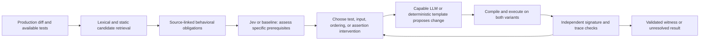

# AI for finding and closing gaps in defect-revealing tests

## Material Passport

- Date: 2026-09-25.
- Origin: researcher request for deeper case research, an assessment by GPT-5.6 Sol, and an innovative experiment plan involving Jev or complementary techniques.
- Status: **research proposal; experiments below have not run**. Source inspection and literature checks are complete for the specific statements attributed below. Model utility and novelty remain unestablished.
- Method: parent-agent case/source investigation plus a separately delegated GPT-5.6 Sol assessment. See [the delegated assessment](ai-case-research-sol-2026-09-25.md). These are two analysis processes, not independent experimental replications.
- Historical boundary: Q0/E1 G1b, F1, and frozen C1 outcomes remain unchanged. This document does not reopen their enrollment rules or spend their remaining budgets.
- Outputs in this pass: this plan and the delegated assessment. No new subject execution, model training, Jev inference, or experiment implementation.

## 1. Recommendation

Investigate whether AI can identify **what prevents an available test from demonstrating a particular behavioral obligation**, then select or construct a small executable intervention that addresses it. Start with regression-test strengthening for known historical repair pairs. Treat the proposed test and explanation as hypotheses until independently checked by execution.

The central question is:

> Given a production change and the available tests, can explicit analysis of test prerequisites help produce a valid defect witness at lower cost, or for more cases, than strong test-generation and concurrency-testing baselines?

Three subordinate questions separate the scientific claims:

1. Does the system distinguish missing inputs/actions, uncontrolled ordering, missing postconditions, and already adequate tests?
2. Does using that assessment improve executable results over simply asking a capable model to improve the tests with the same source and execution access?
3. Does Jev add value to that system, compared with deterministic checks or the same capable model doing all assessments?

A positive answer to question 1 alone is insufficient: a plausible explanation that does not improve the test is not the desired contribution. A positive answer to question 2 does not establish that Jev is useful; question 3 needs its own ablation.

This is a stronger use of our existing assets than adding another scalar relevance feature to the old TCP model. It is also a harder claim. Generic AI test generation, mutation-guided generation, and AI-assisted concurrency testing already exist.

## 2. What the actual cases tell us

The Go source mechanisms below are recorded in the [C1 subject manifest](../../research_runs/ci_configuration_2026_09/subject_manifest.json) and preserved production patches. The observations are historical, not new measurements in this pass.

| Case | Observed evidence | Candidate task for AI | What must remain unresolved until checked |
|---|---|---|---|
| POOL-162 | The fix adds cleanup for an interrupted pool borrower and adds a test that interrupts a waiter, returns an object, then borrows again. The three candidates in the earlier Jev probe do not exercise that interrupted-waiter behavior. | Identify the missing action and subsequent capacity/progress check; select or construct the smallest relevant test extension. | No current Java restoration or whole-suite coverage claim. The three-candidate probe does not prove no pre-fix test could expose it. |
| grpc1859 | Removing send-quota return statements on the error path reproduces the historical production defect. C1 observes 5 focal failures in 60 defective attempts. | Connect an unsuccessful large-message write to resource recovery and the behavior of a subsequent write; propose a relevant workload or test extension. | A resource-accounting story does not yet prove which change improves triggerability. |
| etcd5509 | An early return leaks a read lock. C1 observes 50 focal failures in 60 defective attempts. | Recover the closed-client/error-path obligation and an executable progress witness; assess whether a simpler existing test is already sufficient. | High existing visibility makes this a poor flagship for improved discovery counts. It is a useful development/control case. |
| k8s26980 | C1 observes 0 focal failures in 60 defective attempts. The unchanged upstream test starts `pop` and a competing locker but has no synchronization proving that `pop` reached the blocked send before the locker acquires the mutex. | Recognize an unestablished test premise; propose an ordering/observation intervention rather than indiscriminately adding inputs. | The absent synchronization is a source fact. The claim that the locker wins in the recorded runs is only a hypothesis: no scheduler trace establishes it. |
| istio17860 | C1 observes 60/60 focal failures on the defective variant; the test already checks restart progress while an epoch exits. | Recognize that the current witness is adequate under the studied protocol, and avoid spending search budget on it. | This does not prove determinism over all environments. |
| etcd7492 | The known deadlock combines a mutex and a channel/expiry path. C1 failures occur only in batch A; host-clock behavior also changes. | Recover the wait-for prerequisites and distinguish a necessary event from speculative environmental explanations. | Do not declare clock drift the cause of the difference. Retain as a difficult later case. |
| grpc2391 | A reset branch clears a healthy replacement transport; the existing test checks subsequent calls. C1 observes 55/60 focal failures. | Test whether an obligation about usable replacement state transfers beyond simple resource-release patterns. | Already high visibility limits headroom; this is a mechanism-diversity/control case. |

### Source checks made during this pass

- [POOL-162 fix, `674a6ba9877d2de7224306c83e7871e1eddeab93`](https://github.com/apache/commons-pool/commit/674a6ba9877d2de7224306c83e7871e1eddeab93): fetched the production and test patch via the GitHub connector. Both keyed and unkeyed pool implementations change. The added regression test is for the unkeyed pool. It is assessment material, not a prospective pre-fix candidate.
- [Pre-fix `TestGenericObjectPool.java`](https://github.com/apache/commons-pool/blob/280c60ac3e918eb7fe8fb542847913bb5317cbc6/src/test/org/apache/commons/pool/impl/TestGenericObjectPool.java): fetched content blob `4008f1ee2b1cca71040feb1c14ee506701e70af9`. Its `testWhenExhaustedBlock` checks exhaustion/timeout; no explicit interrupt occurrence was found in this file. This is a file-level inspection, not a proof about inherited helpers or the entire test suite.
- [Kubernetes `processor_listener_test.go`](https://github.com/kubernetes/kubernetes/blob/628af356b8c83f98ee3b50dfcf8b0250816a5581/pkg/controller/framework/processor_listener_test.go): fetched content blob `ffd72d8fae243a1e221a574781a87ed2107aaf1a`, matching the preserved artifact. `TestPopReleaseLock` accepts a locker completion without observing the intended blocked-send premise first. A source-compatible successful ordering exists without exercising that premise.
- [grpc1859 restoration](../../research_runs/ci_sensitivity_2026_09/task5_grpc1859_restoration.md): expired TLS certificates also caused exploratory timeouts, with stacks different from the focal quota leak. These are known harness-confound examples, not a measured production nuisance cohort.

### A useful connection across the cases

**Inference:** POOL-162, grpc1859, and etcd5509 share an exceptional-exit resource obligation: an operation acquires or reserves something, interruption/error/closure changes control flow, and a later operation should still make progress. The resources and APIs differ, but the test often needs both the exceptional event and a subsequent operation that exposes unreleased state.

This suggests testing transfer of an obligation representation across cases. It does not establish that a universal release template solves them. A deterministic resource-lifecycle template is therefore an essential baseline, not something to omit in favor of AI.

## 3. Where AI would fit

Use the following division of work as a hypothesis to test, not as a mandatory product architecture:

### Static analysis and inexpensive retrieval

Reuse T0 for candidate retrieval. Add a bounded call/resource slice where available: relevant calls, lock operations, channel operations, exceptional returns, and test assertions. Treat a static graph as an approximation; unresolved dispatch or reflection must not become a negative coverage claim.

### Jev: narrowly scoped semantic assessment

Current [TypeSafe documentation](https://docs.typesafe.ai/introduction), checked through Context7 and the official site, describes typed Choice, Score, and Noul judgments. It is not a free-form code generator. The proposed role is to assess small source-grounded questions, for example:

- Does this test request interruption of a borrower that is waiting for pool capacity?
- Does it check a subsequent successful borrow after that interruption?
- Does the available evidence establish the required event order, contradict it, or leave it unknown?
- Does an error-path test subsequently exercise the same constrained resource?

Use explicit `supported`, `contradicted`, and `unknown` choices where appropriate. Missing source is `unknown`, not evidence of absence. Source line identifiers and predicate IDs are supplied by the packet builder; a typed choice alone is not a citation or proof.

The [confidence documentation](https://docs.typesafe.ai/confidence) says confidence summarizes the shape of the returned probability distribution. It is not an empirically validated defect probability for our cases. Measure predicate reliability and selective error on independently assessed examples. Do not multiply correlated predicate probabilities into a synthetic probability that the software is safe.

Freeze requested and returned model identities, rubric, source slices, and full responses. A stable version selector must be verified before collection; if only a moving alias is available, detect version changes and separate runs. The earlier `jev-1.13.0` probe is neither a current capability guarantee nor a benchmark result.

### A capable generative model

Use a model such as GPT-5.6 Sol to propose obligations, test extensions, or an ordering intervention, and to repair compilation errors within a fixed budget. Do not assume the same model must generate obligations and tests: compare the simple single-model baseline first.

Permit changes to the test/harness under declared rules. Prohibit production fixes, assertion removal, swallowing failures, deleting the relevant scenario, and arbitrary sleeps presented as proof of ordering. The model does not edit the independent assessment oracle.

### Execution and controlled concurrency

Execution determines whether a proposed witness is supported. Schedule exploration is appropriate when the required operations already exist but their relevant ordering is not exercised; it cannot create a missing interrupt call or missing assertion by itself.

For Java, [Fray](https://github.com/cmu-pasta/fray) is a candidate backend and baseline, with controlled scheduling and deterministic replay. Context7 did not return a matching Fray library after two searches, so official repository/paper sources were used. Compatibility with the historical Commons Pool build is **unverified**. Do not quietly modernize the runtime and call it historical reproduction. For the old Go subjects, no compatible deterministic scheduling backend has been qualified; source-level test coordination or instrumentation would require a separate semantic-validity check.

An instrumentation hook may control a legal ordering, but must not change production results, suppress operations, or create an impossible execution. Record whether a witness is observable without instrumentation. Instrumentation-dependent results remain explicitly scoped.

## 4. What might be innovative, and what is already occupied

This is a targeted primary-source scan, not a systematic novelty certification.

| Prior work | Established overlap | Consequence for our plan |
|---|---|---|
| [DiffTGen, ISSTA 2017](https://cs.brown.edu/people/qxin/papers/testgen_issta17.pdf) | Differential test generation for patch assessment | Comparing variants with generated tests is not a new contribution. |
| [TestGen-LLM, 2024](https://arxiv.org/abs/2402.09171) | LLM improvement of existing tests with execution/coverage checks | A generate-build-run loop is a baseline. |
| [CoverUp](https://arxiv.org/abs/2403.16218) | Coverage-guided LLM test generation | Must compare against coverage-oriented feedback where applicable; its Python implementation is not automatically a runnable Java/Go comparator. |
| [ACH, 2025](https://arxiv.org/abs/2501.12862) | Concern-specific mutation-guided LLM test generation | Semantic concerns plus mutants plus generation are already occupied. Synthetic controls must be separate from historical defects. |
| [InferROI, ICSE 2025](https://arxiv.org/abs/2311.04448) | LLM inference of resource acquisition/release intentions combined with static leak detection | The cross-case resource analogy is useful experimental structure, not a new semantic-analysis technique by itself. |
| [Fray](https://arxiv.org/abs/2501.12618) | General JVM controlled concurrency testing, including benchmark evidence from JaConTeBe | Controlled scheduling is established and deserves a strong baseline. |
| [Themis, NSDI 2026](https://www.usenix.org/conference/nsdi26/presentation/cao) | Static race analysis, LLM test generation, directed fuzzing for distributed systems | Simply combining these three components cannot be our novelty claim. |
| [DeltaScout thesis, August 2026](https://repository.tudelft.nl/record/uuid:afc56588-8e7a-464d-bbec-82a343f53371) | An agent and optional call graph select interesting concurrency events before scheduling | AI event selection is also occupied. The thesis reports mixed gains, including no improvement in JaConTeBe bug count, making schedule-only enthusiasm unwarranted. Thesis evidence is distinct from peer-reviewed evidence. |
| [2026 replication of LLM test-generation techniques](https://arxiv.org/abs/2601.09695) | A strong plain model can outperform elaborate pipelines on studied test metrics | Same-model, strong-prompt, execution-enabled baselines are required. Extra architecture must earn its cost. |

**Candidate contribution:** explicitly separating missing test prerequisites and testing whether that separation improves the choice among test extension, schedule exploration, assertion improvement, and no intervention. A useful output contains an executable witness and a trace of the prerequisites actually reached. It must outperform strong fixed and generative alternatives, not merely produce better explanations.

**Unsettled:** whether this narrower combination remains novel after a full comparison with adequacy, vacuity detection, test amplification, active testing, and concurrency-testing literature. If existing work already supplies the method, the contribution could be a replication/benchmark or empirical boundary result instead.

## 5. Proposed experiments

All numeric budgets and advancement rules below are proposed design choices, not measured cost forecasts or powered sample sizes. The new study gets a separate ledger and freeze.

### E0 — qualify the task and independent assessment

Start development with POOL-162, grpc1859, k8s26980, and istio17860. They represent a missing exceptional action, rare resource-loss visibility, an unestablished ordering premise, and an already effective witness. Use etcd5509 for rubric/debugging checks. None of these familiar cases is an independent final holdout.

Build one packet per case containing exact revisions, original test universe, production-only diff, build recipe, permitted interventions, and input-availability cutoff. Separately retain the historical regression test, known mechanism, focal signature, and acceptable counterpart for assessment.

For the initial task, the production repair diff is **allowed** information: this is retrospective regression-test strengthening around a known change. Added regression tests, issue explanations and historical witness outputs are hidden from the method unless a separately declared information-rich arm supplies them. Do not call these results prospective discovery of previously unknown defects.

Establish source-linked prerequisite records such as `waiting borrower`, `interrupt`, `subsequent borrow`, and `postcondition`, with `observed`, `entailed by inspected code`, `hypothesized`, or `unknown` status. Do not turn the analyst's guessed bottleneck into ground truth. Multiple interventions may work; there need not be one true action label.

The withheld human regression test is an assessment-only reference, not automatic ground truth or a guaranteed upper bound on effectiveness. It must satisfy the same focal-validity checks. Any claim that a witness is missing is limited to the frozen candidate universe, assessed conditions, and available evidence.

Before a quantitative diagnostic study, obtain two independent human annotations of the source-linked facets, measure agreement before adjudication, and preserve disagreements as unresolved where needed. A proposed calibration target is Krippendorff's alpha of at least 0.70 on a sufficiently varied annotation pilot; the number is a design choice, not a universal validity threshold. If qualified human adjudication is unavailable, keep labels provisional and limit the study to independently executable contrasts. A second model is not a replacement for this gate.

**Gate:** each case must have an authenticated pair, a usable build, an admissible observation/intervention, and a check independent of the proposer. If fewer than three structurally different cases qualify, report task feasibility rather than training a classifier around one bug. Java restoration is a new task; old Go image IDs must be checked for current availability.

### E1 — does prerequisite assessment add information?

Give methods raw, equally bounded source packets; do not give Jev the human-written answer in its state. Compare:

1. T0 plus deterministic call/assertion and resource-template checks.
2. One capable LLM returning the same structured answers and source references.
3. Jev on the same source slices and predicates.
4. Static extraction plus Jev, with the extraction also supplied to comparator 2.

Measure predicate errors, unsupported absence claims, abstention, and source-reference correctness. Use normalized test variants with one prerequisite removed/restored only as **synthetic diagnostic controls**, grouped with their parent case. Include legitimate tests and missing-context packets. Count test variants neither as independent defects nor as industry prevalence evidence.

Always report false-adequate decisions and recall for independently established gaps, alongside answer coverage. Abstaining on everything cannot win. Do not certify a low false-adequate rate from this small pilot: even zero errors among 12 independent gap cases has a one-sided exact 95% upper error bound of about 22%. Facet agreement is a diagnostic endpoint; E2's executable result remains primary.

The earlier summarized POOL probe motivates this check but is not an E1 observation. Strong rubric answers without better E2 results do not justify the architecture.

### E2 — the main experiment: can the assessment improve executable witnesses?

Primary outcome: number of authenticated defect cases for which a method obtains a valid witness within the fixed search budget. Report results per case and per model run, not a pooled attempt success rate.

| Arm | Intervention strategy |
|---|---|
| B0 | Existing test, ordinary reruns; reference only, not the main novelty comparator. |
| B1 | Fixed deterministic resource/test templates plus applicable schedule exploration. Same legal intervention bank and execution feedback as the AI methods. |
| B2 | Strong single-model baseline: raw source, diff, static context, and compile/run feedback; asks directly for a defect-revealing test without the proposed decomposition or Jev. |
| B3 | Proposed prerequisite/action decomposition, using the capable model for judgments and generation; no Jev. |
| B4 | Same decomposition and generator with Jev replacing the narrow judgments. |

Proposed development budget: four cases, five arms, three fresh model/search sessions per arm, each capped at 600 seconds of warm search. This is at most **10 wall-clock hours of search**, excluding common restoration and independent verification. B0/B1 use fresh declared search seeds, not fictitious model samples. All cold setup, inference latency, tokens, execution CPU time, allocated vCPU-hours and host-reservation hours are reported separately. API cost remains unknown until current prices and actual usage are recorded.

Predeclare a common generation/token allowance and tool interface. Run both a matched execution-budget view and a matched total-cost view; a semantic router does not get free preprocessing. No method gains extra hidden oracle hints or extra repair attempts after failure. Apply resource limits and fresh resets consistently, with randomized arm order within case/run blocks.

**Witness acceptance requires all of:**

- Compiles and invokes the intended production behavior.
- Captures the required premise, not just a timeout or unrelated exception.
- Produces focal supported failure on the defective variant and the intended acceptable behavior on the counterpart under the declared validation conditions.
- Contains no unauthorized production semantic change, assertion weakening, or reading of variant identity to fabricate a difference.
- Survives clean reset and independent replay under the frozen validation procedure.

Use five clean replays per variant for deterministic controlled witnesses as an initial engineering check, with all outcomes reported. For randomized witnesses, use a separately fixed 20-seed validation schedule and report paired outcomes and uncertainty. Neither rule proves universal correctness or estimates natural manifestation rates. Validate source-admissibility and the observation mechanism as well as the outcome contrast.

Add a secondary **policy-visibility check in E2**, rather than postponing the entire CI connection. For each frozen accepted witness, collect five separately reset triplets per variant under an unchanged protocol, then apply the existing P1/P3/P3-retain semantics to each consumed prefix. Reuse already collected validation attempts only if their ordering/reset protocol was frozen compatibly beforehand; never concatenate adaptive search attempts or different generated tests into a retry trace. Report focal witness occurrence, final blocking, and retained warning separately. A research-only suffix cannot rescue the policy's detection score. Five triplets are descriptive engineering evidence, not a policy-effect confirmation, and all extra verification cost is charged.

Secondary outcomes: restricted mean time spent without a valid witness up to the 600-second cap (failures stay censored at the cap), inference/execution cost, invalid-witness rate, known-adequate cases left alone, and which intervention classes succeeded. Never report only time among successes.

Report total cost per validated defect case, including failed searches and verification. For E0-E2 together, propose a whole-stage ceiling of 80 researcher-hours, 400 allocated vCPU-hours, 200 generative calls, 500 Jev calls, 4 million input tokens, and USD 300 in external-model charges, stopping at whichever ceiling binds first. These are planning envelopes, not permission to spend or estimates that the study will fit. Record human time explicitly; unknown time remains unknown. Recalculate feasibility from one restored case and actual provider pricing before freeze. If the full matrix cannot fit, reduce it before outcomes are inspected or propose a separately recorded expansion; do not selectively drop expensive unsuccessful arms. Restoration, compatibility work, API failures, cold builds, and policy verification all count. No C1 budget is transferred.

**Development advancement rules:** seek an advantage over B2 on at least two cases spanning two projects, or matched witness yield with at least 20% lower total measured cost. These are investment criteria, not significance tests. Compare B4 against B3 separately: if Jev adds no measured benefit, remove it. If B1 matches the AI methods, prefer the deterministic approach. If all methods succeed equally cheaply, preserve that result and stop claiming a new assessor.

The four-case outcome is engineering evidence for whether to invest in a broader study. It is not evidence of population superiority, and a failed engineering gate does not establish equivalence.

### E3 — establish whether the result travels

After E2, freeze architecture, prompts, tool interfaces, thresholds and assessment protocol. Acquire a new roster by source/structural criteria, not observed pass/fail rate. An initial target of at least 12 authenticated defects across at least four projects provides a broader feasibility sample, **not a promised adequately powered confirmation study**. Estimate the needed independent case count from a prespecified practical effect and realistic paired success/cost scenarios before making confirmatory claims.

The delegated assessment proposes a larger acquisition target of 36 episodes across six projects, including adequate, inadequate, and unresolved cases. Retain that as a possible diagnostic-study target after feasibility, not as a fixed confirmation sample: neither 12 nor 36 automatically gives the required power, project-level precision, or rare-error assurance.

Hold out whole projects or mechanism families. Keep resource-leak analogues together when estimating uncertainty about transfer. Report exclusions and acquisition failures. Public historical cases may have appeared in model training; redacting IDs or renaming variables diagnoses reliance on names but does not remove contamination. Stronger evidence requires post-cutoff/private cases with permission, or prospectively collected new cases. A retrieval sandbox alone does not solve pretraining contamination.

Use case/project-level paired summaries and uncertainty. Multiple tests, paraphrases, seeds, model responses, and reruns from one defect remain dependent observations. Freeze one main B4-versus-B2 comparison only if E2 retains Jev; otherwise B3-versus-B2. Treat component ablations as secondary and avoid promoting whichever contrast happens to win.

### E4 — reconnect to TCP only if the evidence supports it

A later system could first retrieve/rank existing tests, detect that their evidence is insufficient, then allocate a bounded test-strengthening action. Compare this with always executing top-ranked tests and always invoking the same generator. Measure supported witnesses per end-to-end budget, including the cost of mistaken abstention and unnecessary generation.

Do not use the HBase/Hive persistence label as product-defect truth. Their supporting artifacts need recovery and temporal-feature audits before new causal TCP claims. F1's stable Airavata null does not warrant reopening fault mappings until a favorable one appears. A fresh TCP model is not a prerequisite for E0-E3.

## 6. Competing directions and why they rank lower now

| Direction | AI role | Current assessment |
|---|---|---|
| Jev as an extra TCP relevance feature | Semantic score in ranking | Useful eventual comparator, but missing witness coverage and uncertain failure labels can dominate; no present incremental benefit. |
| AI log triage or automatic focal-oracle replacement | Interpret dumps and classify failures | Current frozen rules already classify these familiar cases. Agreement is not new value; models must not overwrite canonical labels. Unseen-log interpretation is a distinct future benchmark. |
| Adaptive choice of more CPU profiles/reruns | Learn which execution to request | C1 supplies no persuasive confirmation signal, and ordinary repeated assessment explains the pilot. Needs genuinely different information-gaining actions. |
| AI prerequisite assessment plus validated test strengthening | Identify missing actions/order/postconditions and propose a relevant intervention | Recommended exploration; concrete cases support the task, while novelty and utility remain testable uncertainties. |

## 7. Implementation deliverables before any measured study

1. Immutable case packets and source hashes, with separate method-visible and assessment-only material.
2. A small prerequisite schema and source-linked examples; no universal scalar safety score.
3. A bounded action interface for existing-test execution, legal test extension, schedule exploration, and abstention.
4. Baseline implementations B1 and B2 before optimizing B4; a compatibility report for legacy runtimes and any scheduler.
5. Frozen independent acceptance rules, clean-reset/replay procedure, and logs linking each witness to both variants.
6. Full input/response caches, model identities, cost/resource ledger, and a report that retains failures and unresolved cases.
7. An experiment freeze with executable commands only after the runner exists. No invented entry command is asserted here.

The next concrete work is E0 packet and harness qualification, followed by the blinded E1/E2 development comparison. Additional architecture, a large model-training run, or more C1 confirmation should follow evidence of value rather than precede it.

## 8. Reconciliation with the delegated assessment

GPT-5.6 Sol recommends the same central direction and emphasizes human annotation reliability, policy visibility, and a larger sealed diagnostic set. This plan incorporates those cautions while keeping **validated executable witness yield** as the main outcome. It does not require scaling a diagnostic classifier before checking whether the decomposition changes executable results: a method may have several valid explanations or intervention choices, making exact facet-label agreement an imperfect proxy for practical value.

Policy visibility is measured early, but appending a known retry reducer does not create novelty by itself. The empirical claim must still be that the method makes a better intervention decision or obtains better supported outcomes than its comparators. The independent report and this synthesis are retained separately so differences in emphasis remain reviewable.
