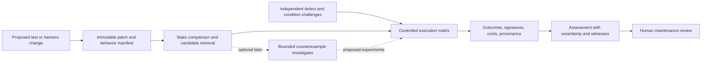

# Independent research vision: improving the reliability of the tests themselves

- **Date:** 2026-09-06.
- **Status:** Independent research judgment and proposals; no new experiments or implementation.
- **Repository baseline:** `d967dbaaec257613c3e1f2440866801c71d0c00e`, branch `research/revival-2026`.
- **Purpose:** Reconsider the project's identity without assuming that test prioritization, adaptive CI investigation, or agents deserve to remain its destination.
- **Scope:** Five competing futures, their scientific and practical merits, one preferred two-year direction, and a conditional five-year vision.
- **Authority:** This is an alternative to, not an amendment or execution of, [ADAPTIVE_CI_RESEARCH_PROGRAM.md](ADAPTIVE_CI_RESEARCH_PROGRAM.md). Existing experimental records remain unchanged.
- **Audience:** A researcher or agent who has no access to the originating conversation.

## 1. My choice

**Inference and recommendation.** I would reshape this project around **validating test maintenance**: determining whether a change that reduces CI failures also preserves the test suite's ability to expose defects. The first product would review proposed test repairs, not generate them. The scientific object would be the change in the quality of the testing instrument.

The question I would put above my desk is:

> When we make a noisy test suite greener, have we improved its reliability, or reduced its sensitivity to broken software?

This includes human-written repairs, changes to fixtures and synchronization, retries, and quarantine. It does not assume that intermittent failures are harmless or that every existing assertion deserves preservation. An incorrect oracle should change; the replacement needs independent justification.

**Inference.** The most interesting lesson in this repository is that predictable failure and useful evidence are different things. A model can become good at anticipating repeated red results without helping developers learn anything new. The existing research tries to repair that mismatch by changing rankings or the evaluation label. I would also question the instrument producing the observations.

**Open question.** This is not an experimentally demonstrated need in these subjects. The repository has not established that their tests were repaired badly, that repairs would outperform scheduling, or that its recurring failures were caused by faulty tests. Those are research questions, not consequences of high historical APFD.

### Reading contract

- **Repository evidence:** Inspected code, local artifacts, or archived outputs. A documented result without recovered outputs is identified as a report, not a reproduced finding.
- **External evidence:** A fact attributed to a linked primary source. Literature inspection here is targeted, not a systematic novelty review.
- **Inference:** My interpretation or comparative judgment.
- **Proposal:** A possible study, design, or decision criterion, not work already performed.
- **Speculation:** A plausible mechanism or application lacking direct evidence here.
- **Long-term vision:** A conditional future capability, not a promised deliverable.

Unless explicitly marked as evidence, future identities and proposed claims below are proposals. Rankings express my judgment, not numerical measurements of opportunity.

## 2. What the repository actually gives us

**Repository evidence.** The required [research state](RESEARCH_STATE.md), [trajectory](TRAJECTORY.md), [experiment registry](EXPERIMENTS.md), and [decisions](DECISIONS.md) are scaffolds. They do not yet constitute a completed, authoritative reconstruction. The substantive narrative is [the August consolidated findings](change-aware-tcp-findings-2026-08.md), introduced in `fd36568`. Its causal language is stronger than the evidence currently recoverable.

| Evidence anchor | What is supported | What is not supported |
|---|---|---|
| Legacy work through `61cb1cc`; pipeline import `820647e` | History, change information, outcome prediction, and temporal evaluation are recurring project assets. | A faithful reproduction of the original DeepOrder paper, or a validated interactive investigator. |
| Airavata archive, `25eb6b7:FINAL6/apache@airavata/step3_report.json` | On 30 small-failure cycles, reported HIST APFD is 0.8237 versus 0.8176 with T0; paired difference -0.0061, p approximately 0.917. The report contains per-cycle results. | That all null effects arise from insufficient headroom. Its 14 larger small-failure cycles also show no benefit. |
| Local `datasets/apache@airavata/` and the preceding repository audit | 11,484 execution records, 55 test identities, 236 executed builds; repeated large co-failure blocks. | Arbitrary rerun outcomes, distinct fault counts, controlled environment comparisons, or developer toil measurements. |
| August findings, HBase and Hive sections | Reports persistence-APFD gains of +0.075 on 108 HBase cycles and +0.029 on 198 Hive cycles. | Independently reproduced gains: supporting raw artifacts were not recovered at the documented local locations during the audit. |
| `pipeline/step3_regapfd.py::regression_labels` | A failing execution is labeled when the next execution of the same test name also fails. | A verified change-induced defect. The function sees neither causal ancestry nor defect identity; terminal failures without a following observation remain zero. |
| `pipeline/lrts_adapter.py::derive_history` | Histories are emitted before updating with the current row's verdict. | Complete causal availability in overlapping CI jobs: build start ordering is not result availability ordering. |
| `pipeline/step3_t0.py` | Prequential training and controlled feature ablations exist. Historical rows remain available irrespective of simulated selection. | Evaluation of the feedback loop induced by skipping tests. |
| `pipeline/fault_structure_probe.py` | Descriptive screening of recurrence, failure counts, and ranking headroom. | A validated latent-fault model or causal explanation of co-failure. |

**Repository evidence.** The current adapter copies the current execution's duration into `Duration`; the ranking feature set includes it. T0 vocabulary/IDF construction also needs a temporal audit before causal reuse. These are reasons to preserve the code as an inspectable baseline, not treat it as a ready production component. Trace MCP was used for project and symbol navigation; the consequential persistence-label and adapter behavior was checked against source.

**Inference.** The trajectory from DeepOrder-inspired prediction through change relevance, Airavata's null, HBase, persistence scoring, and Hive is better read as a struggle to define *valuable failure evidence* than as steady confirmation of a relevance mechanism. Several explanations remain compatible with the observations: recurring product defects, common infrastructure conditions, test dependencies, branch mixing, easy-to-predict failures, and evaluation artifacts. “History learns flakes; changes find regressions” is one hypothesis among them.

**Inference.** The reusable advantage is familiarity with longitudinal failure structure, identity joins, temporal pitfalls, and uncomfortable negative results. It is not a proprietary model or an already executable collection of CI incidents. A new direction should exploit those lessons without allowing sunk implementation cost to decide the research question.

## 3. Five futures, ranked

| Rank | Identity | Main object being changed or understood | Scientific value | Novelty risk | Repository head start |
|---|---|---|---|---|---|
| 1 | **Test-maintenance validation** — unconventional experimental direction | The sensitivity and noise of the tests themselves | High if it reveals and prevents concealed loss of protection | High: intent-preserving repair already exists | Moderate conceptual; low executable |
| 2 | **Auditable selective CI** — ambitious, primarily non-agentic research | What can be inferred about failures that a selection policy does not observe | High if valid estimates remain affordable under evolution | Very high for exploration or random audits alone | Stronger methodological fit; missing prospective data |
| 3 | **Evidence expiration across software changes** — academic program-analysis direction | When an old testing conclusion ceases to apply | Potentially high; difficult to make precise | High: overlaps incremental verification and test selection | Change joins help; semantic foundations absent |
| 4 | **Failure-episode accounting** — industry/product direction | Repeated human investigation and ownership handoffs | Moderate scientific value; potentially immediate practical value | High: CI analytics and failure grouping are established | Recurrence analysis helps; logs and workflow outcomes missing |
| 5 | **A measurement science of CI benchmarks** — conservative direction | Whether benchmark scores measure independent, useful discoveries | High if it changes conclusions across studies | High unless it goes beyond existing LRTS analyses | Strongest immediate fit |

### 3.1 Test-maintenance validation

**Proposal.** Study interventions on tests and their execution conditions. Distinguish reducing unwanted interruptions from preserving sensitivity to independently justified defects. Ask which changes improve both, which create a tradeoff, and whether a reviewer can detect the tradeoff affordably.

**Why it matters.** A scheduler repeatedly pays the cost of a poor signal. A good fixture or isolation repair might improve many future executions. Conversely, a seemingly successful repair can remove an important behavior from the test. An unchanged assertion does not guarantee unchanged coverage: a new mock, seed, setup path, or synchronization rule can prevent that assertion from encountering the defect.

**Repository support and abandonment.** Recurrence and co-failure analyses can locate candidate problem areas and motivate intervention-level accounting. None supplies a repair-effect label. I would stop classifier tuning and stop treating frequent failures as either valuable faults or disposable noise by default. Much of the current dataset would become background and screening material.

**Novelty and failure.** The candidate contribution is a reproducible assessment of noise reduction versus retained defect sensitivity across concrete maintenance interventions, followed by a useful independent validator. “Repair tests without losing intent” is already established research. The direction fails if ordinary static checks plus reruns are sufficient, or if credible defect challenges cannot be assembled without hand-engineering the answer.

### 3.2 Auditable selective CI

**Proposal.** Ask what a CI service can legitimately say it missed, given selective execution, delayed feedback, and an evolving candidate-test set. Optimize the cost of obtaining an honest estimate, rather than only the number of observed failures.

**External evidence.** Facebook's predictive selection paper already describes independently sampled changes with complete impacted-test learning runs, as well as separate stabilization testing. It explicitly addresses the missing-outcome problem. Random audits and retraining are established practice, not this project's invention. [Machalica et al., 2018, Sections II-B and IV-C/D](https://arxiv.org/html/1810.05286v1).

**Inference.** A potentially meaningful departure would quantify when those practices are insufficient or unnecessarily costly: for example, with delayed results, changing candidate universes, or a target defined over new failure-bearing changes. Marginal random test sampling does not automatically estimate missed unique defects. That requires knowing which tests expose each defect, or stronger audit units and adjudication.

**Repository support and abandonment.** The temporal harness and historical features help construct an observation-censoring study. It must rebuild history from actually revealed outcomes; skipping a row cannot secretly preserve its precomputed history contribution. Static data can support restricted masking experiments, not show how different selection changes developer repairs or future commits. I would abandon a novel-selector claim unless it beats a strong independently sampled full-suite audit baseline.

**Failure mode.** Cheap fixed audits may already solve the practical problem. A generic bandit with CI terminology would be incremental. This is my strongest non-agentic alternative, but not my first choice after inspecting its existing industrial foundations.

### 3.3 Evidence expiration across software changes

**Proposal.** Replace “which test is relevant?” with “which previous conclusion has lost its justification?” A conclusion might be narrowly scoped: a parser accepted a specified input family under a recorded dependency version. A changed dependency, oracle, configuration, or data contract can invalidate the transfer of that evidence.

**Speculation.** A useful system could distinguish stable behavioral obligations from obsolete execution facts. This might connect code evolution to test maintenance more directly than a relevance score: a renamed class need not invalidate behavior, while an unchanged class using a changed external schema might.

**Repository support and abandonment.** Changed-file joins and test identities provide bookkeeping. They do not identify behavioral obligations or prove evidence transfer. T0 would become a candidate-retrieval baseline. A program-analysis and specification effort would replace most of the ML pipeline.

**Novelty and failure.** The challenge is scoped semantic transfer for noisy, partly specified evidence. Dependency invalidation and incremental verification already occupy much of this territory; a graph visualization alone adds little. It fails if the claimed semantics reduce to ordinary dependency reachability, or if meaningful specifications cannot be recovered. I would not claim a novelty gap without a separate review of incremental verification and assurance-case maintenance.

### 3.4 Failure-episode accounting

**Proposal.** Build a ledger that separates an execution, a symptom group, a suspected shared episode, and a developer-confirmed cause. Its immediate user is the platform engineer repeatedly determining whether today's red CI needs a new investigation or is linked to an already owned issue.

**Speculation.** The smallest wedge is a read-only “what is new since the last investigated failure?” report with evidence links and explicit uncertainty. It should merge neither failures nor tickets automatically. Success is fewer duplicate investigations and faster correct ownership assignment, without hiding new symptoms inside an old cluster.

**Repository support and abandonment.** Failure structure supplies a useful starting vocabulary, but logs, issue links, ownership records, and observed human effort are new data. APFD and a flaky-versus-regression classifier would be retired as the primary objectives.

**Novelty and failure.** Failure grouping and flaky-test lifecycle tooling already exist; [Buildkite's documented workflows](https://www.buildkite.com/resources/blog/introducing-test-engine-workflows/) illustrate the product competition. The research would need validated distinctions between symptom recurrence and cause recurrence, plus workflow outcomes. It fails if existing search and issue linking achieve comparable results, or episode errors create more triage work than they save.

### 3.5 Measurement science of CI benchmarks

**Proposal.** Quantify which published conclusions survive changes in the unit of analysis, causal feature availability, failure-to-fault mapping, censoring, and operational cost accounting. A benchmark could report a range of conclusions under plausible episode interpretations instead of declaring every failing test a distinct fault.

**Repository support and abandonment.** This is the closest fit to archived outputs, the persistence-label implementation, and the unresolved HBase/Hive reconstruction. Preserve negative results as evidence about evaluation conditions. Abandon the obligation to produce a winning algorithm.

**External evidence.** LRTS already examines confounding failures, failure-to-fault mappings, and first failures across many techniques. Repeating “simple history is strong and flakes matter” would add little. [Cheng et al., ISSTA 2024](https://samchengcs.github.io/paper/cheng2024revisiting.pdf).

**Novelty and failure.** The stronger contribution would identify reproducible, consequential ranking reversals caused by chronology or uncertain episode identity, supported by independently audited cases. It fails as a major paper if it only documents defects in this repository or renames existing metrics. It remains worthwhile scientific cleanup even then.

## 4. Why I would not preserve the adaptive-CI roadmap

**Inference.** [The previous program](ADAPTIVE_CI_RESEARCH_PROGRAM.md) is a defensible feasibility proposal. It correctly refuses to simulate unobserved reruns from CSV tables, separates differential reproducibility from causal diagnosis, and excludes an LLM in version 1. Those are strengths worth keeping.

I nevertheless disagree with making it the project's main destination:

1. **Its scientific object is weakly connected to the strongest assets.** Allocating reruns between one head and one reference revision makes most change-to-test relevance, test-population structure, and longitudinal history peripheral. The connection is thematic, not a demonstrated transfer of capability.
2. **The minimal problem may be too standard to carry the vision.** A two-arm probability-estimation problem with cost-aware posterior variance reduction is useful experimental hygiene. A positive result would not establish the value of open-ended investigation or a new software-engineering mechanism.
3. **It starts after detection.** It cannot tell us whether the suite produces useful signals, whether important defects have no effective test, or whether an attempted noise reduction destroyed protection.
4. **Artifact recovery becomes the project before the scientific leverage is known.** Controlled head/reference execution is expensive to reconstruct. That effort is justified only if its eventual question is stronger than a small adaptive-versus-fixed allocation comparison.
5. **Its objective can improve without improving engineering decisions.** Better estimates of recurrence probabilities need not change escalation or reduce developer work. Even a carefully chosen Brier-score improvement leaves that bridge unproven.

**External evidence.** Information-guided sequential diagnosis predates modern agents, and probabilistic culprit finding already handles noisy software failures. These are serious comparison points, not historical footnotes. [SEQUOIA](https://ojs.aaai.org/index.php/AAAI/article/view/7844), [Google's Flake Aware Culprit Finding](https://research.google/pubs/flake-aware-culprit-finding/).

**Inference.** It would be unfair to call the previous prototype agent fashion: it explicitly excludes agents. The risk lies in treating any adaptive prototype as a stepping stone that inevitably justifies an investigator platform. The repository does not establish that escalation path.

**Proposal.** Retain the controlled rerun design as an optional measurement module. Repeated execution can estimate the effect of a test repair just as it can estimate a revision difference. Do not fund a general investigation controller first.

## 5. The preferred scientific problem, made concrete

### 5.1 Separate changing the software from changing the observer

**Proposal.** Consider a maintenance patch that changes a test or its harness while leaving intended product behavior fixed. Compare the old and revised observer on both a reference implementation and independently justified defective variants, across specified execution conditions.

| | Reference implementation, no selected challenge defect | Implementation containing challenge defect D |
|---|---|---|
| Original test/harness | Establish baseline interruptions and conditions | Establish original sensitivity to D |
| Revised test/harness | Measure interruption reduction | Measure retained or lost sensitivity to D |

Do not call the reference implementation universally bug-free. It is the reference for the selected behavior and challenge. If a product change and a test repair cannot be separated meaningfully, record a different intervention class or abstain from this comparison.

**Proposal.** Let `p(T, P, E)` denote the probability of a specified test outcome or signature when observer `T` runs program `P` under protocol `E`. Record the entire four-cell result. A useful secondary quantity is the defect-associated increase `p(T, P_D, E) - p(T, P_0, E)`, compared before and after maintenance. It helps avoid rewarding a test that fails on everything. It is not a universal scalar definition of test quality: unrelated signatures, multiple defects, and meaningful environmental interactions require separate interpretation.

For example, changing a timing-dependent test to wait for an explicit condition might remove irrelevant scheduling variation while retaining detection of a missing state transition. Replacing the interaction with a mock might also make it pass reliably while preventing it from exposing the missing transition. These are hypothetical examples, not observations from Airavata.

**Inference.** This gives the old flake/regression problem a better shape. Intermittency is an observation about executions. Defect sensitivity is a relationship among the test, a particular defect, and conditions. A nondeterministic product defect can be precisely what the test should reveal. “Deflaking” is not automatically improvement.

### 5.2 What could be new, and what already exists

**External evidence.** The broad idea is occupied. [Intent-Preserving Test Repair, ICST 2019](https://damorim.github.io/publications/xiangyuETAL-icst2019.pdf) uses dynamic symbolic path conditions to rank repair candidates. [FLEX, FSE 2021](https://www.cs.cornell.edu/~saikatd/papers/flex-fse21.pdf) statistically adjusts approximate assertions or rerun counts for randomized ML tests and discusses the cost of restricting randomness. [FlakyDoctor, ISSTA 2024](https://yangc9.github.io/files/ChenETAL24FlakyDcotor.pdf) combines LLMs, analysis, and execution validation for flaky-test repair. Preserving intent, statistical repair, and a tool-using repair loop are not new claims.

**Proposal.** The candidate distinction is an **independent, intervention-level evaluation of retained defect sensitivity under nondeterministic conditions**, applicable to repairs produced by different methods. It should examine changes to fixtures, inputs, isolation, and execution conditions, not only obvious assertion removal. It should expose the limits of rerun success and static preservation proxies with executable counterexamples and an assessment method that works on unseen repairs.

**Open question.** Whether this combination is sufficiently new remains unsettled. A full comparison against repair-validation and test-evolution literature is a gate, not a writing exercise after building the tool. If an existing method already answers it, the right contribution may be replication, broader evidence, or an industrial application rather than a new method.

**External evidence.** Mutation analysis has evidence of association with real-fault detection, with important limits; it is not an oracle for real-world protection. [Just et al., FSE 2014](https://homes.cs.washington.edu/~mernst/pubs/mutation-effectiveness-fse2014-abstract.html). Flakiness can itself distort mutation-based assessment. [FlakiMe](https://arxiv.org/abs/1912.03197).

**Proposal.** Therefore use known defects and independent behavioral obligations where feasible; use mutants as explicitly synthetic challenges. Report them separately. Freeze a held-out challenge set that neither repair generator nor validator can tune against. A validator that merely detects its own hand-designed weakening examples has not earned a scientific claim.

### 5.3 The first three major research questions

1. **RQ1 — Measurement:** How often does successful noise reduction conceal reduced defect sensitivity, and which intervention types cause it? Include beneficial repairs, neutral repairs, and unresolved cases; do not recruit only suspicious patches.
2. **RQ2 — Assessment:** Can a bounded combination of program analysis and independent executable challenges identify sensitivity loss more accurately than reruns, unchanged-assertion checks, or developer acceptance alone?
3. **RQ3 — Value:** Does this assessment change real maintenance decisions and reduce repeated CI interruptions without increasing missed independently adjudicated failures? Developer acceptance and short-term pass rate are secondary evidence, not substitutes for this outcome.

**Proposal.** The first decisive study would use existing human and tool-produced repair patches. Do not build a repair generator to create the phenomenon we hope to detect. Start with a small qualification sample spanning at least two repair mechanisms and several projects. Attempt to reconstruct the four-cell comparison, report every failed reconstruction, and determine whether an independent challenge reveals a material distinction that reruns and static checks miss.

**Inference.** A single convincing example establishes possibility; it does not establish prevalence, prediction accuracy, or a product market. A strong continuation case needs naturally occurring examples on held-out projects and useful discrimination between good and bad changes at acceptable cost.

## 6. Five possible papers, with different claims

These are candidate claims to test, not conclusions available for submission today. Venue families indicate audience fit, not acceptance predictions.

| Direction | Candidate central claim | Required evidence and strongest comparison | Novelty risk | Burden, value, and likely audience |
|---|---|---|---|---|
| **1. Does CI maintenance preserve defect sensitivity?** | Execution success after test maintenance is insufficient; independent challenges identify consequential losses missed by common validators. | Reconstruct authentic repair pairs; compare reruns, static checks, applicable intent-preservation methods, and independent challenge assessment; include real defects, synthetic challenges separately, and blinded adjudication. | Existing repair correctness and intent preservation; merely discovering assertion deletion is weak. | High artifact burden; high value if a generalizable assessment emerges. ISSTA/ICST, then ASE/FSE or TSE/TOSEM. Repo supplies motivation and analysis discipline, not the benchmark. |
| **2. What can selective CI know it missed?** | A specified audit design estimates missed failure-bearing changes reliably under defined evolution and delay conditions at lower cost than complete learning-run sampling. | Verified test universes and timestamps; prospective audit probabilities; strong Meta-style audits; complete observations on assessment units; limits under drift. | Exploration, audit sampling, and sample-efficient model evaluation already exist. | Medium-to-high data and theory burden; high value if honest bounds are affordable. ISSTA/FSE, empirical software engineering, or applied ML evaluation. Temporal pipeline is a meaningful but incomplete head start. |
| **3. When does testing evidence expire?** | A scoped representation transfers useful behavioral evidence across some changes while detecting invalid transfer better than path/dependency invalidation. | Explicit obligations, revision pairs, dependency baselines, independent counterexamples, held-out change types; soundness only where assumptions justify it. | Incremental verification, regression selection, test evolution. | Very high semantic and artifact burden; potentially high value. ASE/ICSE; verification venues only with a substantive formal result. Current head start is small. |
| **4. The cost of investigating the same failure twice** | Episode-aware evidence linking reduces duplicate human investigation without conflating new defects with known failures. | Prospective platform-team study; issue-linked adjudication; compare ordinary signature search/grouping; measure time, erroneous merging, ownership accuracy. | Existing incident management, CI analytics, log clustering. | Medium integration, high access burden; high practical value. MSR/EMSE and ICSE/FSE industry tracks. Recurrence probes help, but human workflow data is absent. |
| **5. How robust are CI optimization conclusions to their unit of evidence?** | Algorithm comparisons change materially under defensible causal timing and episode interpretations, beyond effects already studied in LRTS. | Recover outputs and reimplement faithfully; cross-project sensitivity analysis; validate episode assumptions; independent replications and transparent negative results. | A local code audit alone is not a general contribution. | Moderate implementation and substantial reconstruction; useful measurement contribution. MSR/EMSE/ISSTA replication or research tracks. Strongest current artifact fit. |

**Inference.** Paper 1 is my choice because it asks whether we can improve the source of evidence and creates a concrete review task. Paper 5 is the responsible fallback if new artifact access fails. I would not split one small study into all five papers or promise publication based on this table.

## 7. Connections worth keeping, and ones to reject

**Inference — measurement theory.** The distinction between precision and validity is useful: making observations consistent does not establish that they track the intended behavior. The four-cell intervention makes this concrete. Calling the suite a “sensor network” without measuring sensitivity changes would contribute nothing.

**Proposal — causal experimentation.** Hold the production revision fixed while changing the test intervention, then challenge both versions under independently chosen defects and conditions. Randomized execution order and controlled resets help distinguish patch effects from environmental drift. Historical before/after pass rates alone cannot do this: teams often change production code, infrastructure, and tests together.

**Proposal — experimental design and information acquisition.** Expensive challenge execution could eventually be allocated to distinguish credible maintenance outcomes. This is where adaptive investigation might become useful: a subordinate tool with a specific validation target. It need not determine the identity of the whole project.

**External evidence and inference — active evaluation.** Active Testing already studies acquiring labels efficiently for accurate model evaluation. It is a useful methodological comparison for the auditable-CI alternative, not evidence that ordinary active learning solves evolving software behavior. [Kossen et al., ICML 2021](https://proceedings.mlr.press/v139/kossen21a.html).

**Proposal — testing economics.** Assess maintenance at the level of a shared fixture or dependency, where one repair could affect many tests. Preserve distinction between compute savings and saved human time. Correlation is only a candidate-selection signal. Research on systemic co-occurring flakiness already motivates shared-root-cause repair, so discovering co-failure blocks is not novel by itself. [Parry et al., Systemic Flakiness](https://philmcminn.com/publications/parry2025.pdf).

**Speculation — adversarial assessment.** Search for a plausible defective implementation accepted by a repaired test but rejected by an independent obligation. Such counterexamples could help reviewers understand what changed in the test's meaning. This is more interesting than two agents arguing about a patch, but it inherits the oracle and synthetic-fault validity problems.

**Reject for now.** A digital twin of software delivery has no validated transition model here. General reinforcement learning has neither trustworthy rewards nor sufficient logged interventions. A graph neural network cannot manufacture missing dependency or fault labels. “Autonomous scientific discovery” is too broad to evaluate. These could become engineering choices later; none currently repairs the project's evidential gaps.

## 8. A company-facing system with a credible wedge

**Proposal.** Start with a **test-maintenance review check** for platform and test-infrastructure teams. On a pull request changing a test, fixture, retry policy, or quarantine state, it produces a compact evidence report:

- what behavior or conditions the change may remove;
- whether the original noise is reproduced and reduced;
- which independently justified defect challenges remain detectable;
- a concrete example of lost sensitivity, if found;
- what could not be assessed and why.

The first deployment should be advisory and limited to one supported language/test runner. It should consume a proposed patch and existing CI artifacts. It should not create unrelated tests, merge changes, or interpret absence of a counterexample as a safety guarantee.

**Speculation.** The buyer could be a platform team responsible for flaky-test maintenance or a team deploying automated repair tools. The immediate workflow is a reviewer asking, “Does this fix preserve what this test was meant to catch?” The advantage must be fewer expensive manual checks or fewer bad maintenance decisions. A prose explanation without an executable witness is unlikely to justify adoption.

**Proposal.** Evaluate against ordinary code review plus reruns, not a deliberately careless team. Measure additional reviewer time, useful findings per review, false alarms, cost per assessed patch, maintenance recurrence, and confirmed losses caught before adoption. Cloud runtime alone is not developer-equivalent effort. No business-value estimate should be inferred from Airavata's failure counts.

**Long-term vision.** The wedge could grow into test-suite maintenance planning: compare isolation repairs, assertion corrections, targeted replacement tests, and continued quarantine using accumulated evidence about sensitivity and cost. It would supply bounded recommendations to existing CI systems. It does not need to own deployment orchestration.

## 9. Do agents belong?

**Inference.** The central scientific comparison does not require an LLM. Execution repeats and branches on outcomes in many ordinary programs; that fact alone does not justify an agent.

| Task | Open-ended reasoning or tool selection? | Minimum implementation | Objective evaluation |
|---|---|---|---|
| Parse patch, preserve provenance, detect removed assertions, schedule a fixed experiment | Usually no | Deterministic code and rules | Correct extraction, reproducible execution, explicit errors |
| Estimate interruption and challenge-detection rates | No | Statistical estimator with declared assumptions | Calibration, interval coverage in supported settings, held-out outcomes |
| Locate changed fixtures and existing tests | Usually bounded | Symbol/dependency queries and retrieval | Relevant evidence recovered, bounded cost |
| Reconstruct an unfamiliar test's behavioral obligation from code, issues, and APIs | Sometimes | Human first; optional single assistant that cites evidence and abstains | Agreement with independently established obligations; harmful invented assumptions |
| Find a subtle counterexample to a proposed repair | Potentially yes | One bounded investigator using execution and analysis tools | Independently validated counterexamples, discovery cost, false claims |
| Approve that the test is now safe or infer product requirements without evidence | No credible autonomous basis | Explicit unresolved status or authorized human judgment | Do not disguise missing ground truth as a model score |

**Proposal.** The no-LLM version is a patch manifest, deterministic experiment runner, evidence store, and assessment report. It is sufficient for the first study. One agent becomes justified only if unfamiliar-code reconstruction or counterexample search is a measured bottleneck that fixed procedures fail to handle.

**Proposal.** If added, that agent gets the same execution tools and budget as comparison methods, with extra human setup time counted. It may propose hypotheses and experiments but cannot change the held-out evaluator, erase failed trials, or relabel an unmet obligation. Compare outcomes on held-out projects; fluent explanations and agreement with its own generated tests are not diagnostic accuracy.

**Long-term vision.** Separate proposal and assessment roles may be useful when searches become complex. Multiple language-model instances do not provide statistical independence or a trustworthy oracle. A deterministic evidence boundary is more important than a multi-agent architecture.

The diagram is a proposed architecture, not an implemented system. Challenge provenance and evaluator independence are requirements even in the no-agent version.

## 10. What I would preserve, stop, and obtain

| Asset or activity | Decision | Reason |
|---|---|---|
| Airavata T0 null and historical archives | Preserve | They constrain optimistic stories about additional features and provide methodological examples. |
| HBase/Hive claims | Reconstruct before using quantitatively | They motivate questions about failure structure; persistence does not certify defect causality. |
| Historical features and prequential evaluation | Adapt selectively | Useful for candidate screening and later recurrence follow-up; use only available observations and prior duration estimates. |
| LRTS adapter and identity joins | Validate, then adapt | Preserve revision, environment, test identity, and availability explicitly; do not erase skipped or missing executions. |
| T0 path relevance | Keep as a cheap retrieval baseline | It can suggest affected tests/components; it should not certify impact or select the evaluator's only challenges. |
| Failure-structure probe | Adapt for screening | Identify possible shared maintenance targets; require logs and intervention evidence before declaring shared causes. |
| Persistence-based “regression” labels | Retire as causal ground truth | Preserve the code and historical result under an accurately named proxy. |
| APFD optimization, another embedding model, broad classifier tuning | Stop as primary work | They do not answer whether the testing instrument improves. |
| Two-action adaptive CI program | Preserve as an alternative proposal | Its controlled execution principles are reusable; its controller need not be built. |
| Research documentation | Preserve and reference | New work must not retroactively convert proposals into findings or delete inconvenient negatives. |

**External evidence.** [IDoFT](https://github.com/TestingResearchIllinois/idoft) provides test identities, detected revisions, categories, and repair/PR status fields. [FlakyDoctor's artifact repository](https://github.com/Intelligent-CAT-Lab/FlakyDoctor) is a candidate source of existing repair subjects. Neither has been downloaded, executed, or qualified in this pass. A merged repair is evidence of acceptance, not independent proof of preserved defect sensitivity.

**Proposal.** Begin artifact qualification there rather than require Airavata to support experiments it never recorded. Select a tractable repair class, such as order-dependent fixture/isolation changes, but retain adverse conditions that could expose genuine product defects. Expand only after a credible comparison is possible. Local CSVs can support historical screening; executable repair pairs, controlled conditions, challenge implementations, and maintainer intent are new requirements.

**Open question.** Linking a real historical defect to the exact program version and repaired test may be difficult. If only mutants are feasible, the initial claim must be “preserves sensitivity to these synthetic challenges.” Do not replace unavailable real defects with generated ones while retaining the stronger claim.

## 11. What I would do with two years

**Proposal.** I would spend the two years on one program: **measuring and preventing loss of defect sensitivity during test maintenance**. Its output should be a credible evidence base and a useful review tool, not another broad CI platform.

| Period | Main intellectual objective | Evidence needed to continue |
|---|---|---|
| Months 0–3 | Establish a distinct question relative to intent-preserving repair; qualify artifacts and behavioral obligations | Authentic pre/post repairs from several projects; reproducible interventions; independent challenge construction. Stop expansion if meaningful comparisons cannot be made. |
| Months 4–8 | Determine whether rerun-success and static checks miss consequential distinctions | A transparent cohort including good, harmful, and inconclusive changes; blinded assessment; all acquisition failures disclosed. One example is not prevalence. |
| Months 9–14 | Develop the smallest assessment method justified by observed failure modes | Held-out repairs and projects; comparisons to existing validation approaches; better detection of harmful changes without overwhelming reviewers. |
| Months 15–20 | Test the workflow with maintainers | Measured review cost, actionable counterexamples, changed decisions, and subsequent maintenance outcomes; no inferred incident prevention. |
| Months 21–24 | Establish transfer and limitations; release reproducible artifacts | Independent replication where possible; explicit unsupported repair classes; a paper whose contribution survives without an LLM leaderboard. |

**Proposal.** A plausible mature study target is dozens of authentic repairs across multiple projects and more than one maintenance mechanism. Counts must follow artifact availability and precision requirements; 10,000 repetitions of three repairs do not supply broad external validity. Cluster analysis by repair and shared root cause. Keep final challenge outcomes held out even if development uses related challenges. Later time periods and unseen projects both matter.

**Inference.** Successful two-year ownership would produce a benchmark that distinguishes quieter tests from better tests, a validator that catches useful non-obvious losses, and evidence that reviewers benefit. It would be an acceptable negative outcome to show that a simple existing validation procedure is sufficient for the studied class. It would not be success to build a large generator that is graded by its own tests.

## 12. Five-year capability, and the risky idea underneath it

**Long-term vision.** A team proposes a test-suite change and receives a defensible account of its consequences: which behaviors remain checked, which conditions were removed, which previously detectable defects now escape, and where evidence is insufficient. The system can recommend a replacement check when a legitimate repair removes incidental protection. It remembers the provenance and limits of those conclusions as the software evolves.

This would be useful for a change as small as replacing a sleep or as consequential as moving integration tests to mocks. It might identify that a shared fixture repair restores useful signal to many tests, while a superficially similar repair hides a product race. Its value lies in concrete witnesses and traceable scope, not a universal release-confidence percentage.

**Speculation — the transformative idea.** Treat test maintenance as a constrained co-design problem: improve the observer while deliberately searching for product defects that the new observer might stop seeing. The output can be a paired proposal: a noise-reducing repair plus a focused replacement test for lost sensitivity. A successful system would make test evolution capable of *increasing* protection instead of merely preserving current assertions.

**Assumptions required:** relevant behavioral obligations can be established independently; realistic challenges can be generated or recovered affordably; controlled execution predicts enough real CI behavior; sensitive information and artifact access can be handled within deployment constraints; and teams value the evidence enough to tolerate its cost. None is established by the repository.

**Inference.** This is a much more demanding destination than a two-arm rerun allocator. It is also a more consequential one. Adaptive experimentation and a bounded agent could eventually help, but they would serve test validity rather than define the product.

## 13. Adversarial review of my own choice

### Objection 1: This is existing test-repair validation with new vocabulary

**Inference.** This is the strongest objection. Intent preservation, mutation testing, flaky-test repair, and patch correctness are established. Combining them in a dashboard is product engineering. The research must demonstrate a failure mode and assessment capability not adequately covered by applicable methods, or produce a valuable independent empirical result. A literature-gap claim based on this targeted search would be premature.

**Proposal.** Before a new method, compare the strongest applicable existing validation approaches on the same executable repairs and independently established challenges. If they already work, use them or publish a replication; abandon the novel-validator story.

### Objection 2: We are replacing weak regression labels with weak challenge labels

**Inference.** A mutation that looks like a bug may violate no real obligation. A test may legitimately stop catching an accidental behavior after repair. A researcher can create a benchmark that makes almost any patch look harmful.

**Proposal.** Establish expected behavior independently of the test being assessed, disclose synthetic challenges, include legitimate oracle changes, and obtain blinded adjudication where possible. Record inability to assess as a result. Do not count every lost mutant kill as a harmful repair. If most subjects cannot be assessed credibly, the program's central empirical claim is not feasible.

### Objection 3: Most good repairs are obvious, and the validator costs more than review

**Inference.** Assertion-removal checks, established repair patterns, a few controlled reruns, and code review may catch nearly everything that matters. Reconstructing rare defects could be expensive research theater.

**Proposal.** Measure incremental findings and review cost against that strong workflow. If non-obvious, independently confirmed sensitivity losses are negligible, or the tool does not change decisions at acceptable cost, abandon the product and substantially narrow the research.

### Additional ways this program could fool us

- **Selection bias:** harvesting only controversial repairs exaggerates harm. Publish the sampling roster and failed reconstructions; stratify developer and tool patches.
- **Environmental confounding:** a repaired test may run under a different JDK, dependency, or resource envelope. Pin and record conditions; investigate interactions rather than silently average them away.
- **Pseudoreplication:** many tests may share one fixture repair and many challenges may share one defect mechanism. Use repair/root-cause units and project-level uncertainty, not execution counts as sample size.
- **Challenge leakage:** feedback can train a generator or reviewer to the assessment set. Separate development challenges from a sealed final set; record who saw which outcomes.
- **False confidence from no observed loss:** finite execution cannot establish universal sensitivity preservation. Report scoped evidence and uncertainty, never a general safety certificate.
- **Language-model persuasion:** a plausible account of intent is not intent ground truth. Judge executable witnesses and independently justified obligations.

**Result that would make me abandon the preferred direction.** A credible multi-project cohort shows no practically important losses missed by ordinary validation, or purported losses disappear when behavioral obligations and environment differences are adjudicated. An inability to obtain independent challenges would also force a reframe; synthetic volume cannot compensate for missing validity.

**Simpler explanation that could make it unnecessary.** Most maintenance changes repair genuinely irrelevant execution conditions, while existing review catches the few semantic changes. Under that explanation, better maintenance adoption and reporting matter more than a new research method.

**Replacement direction.** I would return to the measurement-science study, with auditable selective CI as a second option only if a partner can provide real selection logs and independent audits. I would not default to agents merely because the preferred non-agentic study failed.

## 14. Final A–J synthesis

**A. Fundamental interpretation.** This project is about the trustworthiness and usefulness of software evidence. Its deepest tension is that frequent, predictable observations are not necessarily informative about defects developers need to act on.

**B. Five futures, ranked.** (1) Test-maintenance validation; (2) auditable selective CI; (3) evidence expiration across changes; (4) failure-episode accounting; (5) measurement science of CI benchmarks. The fifth has the best immediate repository fit; the first has the strongest combination of a consequential question and a concrete future review task.

**C. My choice.** Investigate whether changes intended to reduce CI noise preserve independently assessed defect sensitivity. Begin by assessing existing repairs, not generating new ones.

**D. Why over adaptive CI investigation.** It attacks the quality of the evidence source and the long-term consequences of changing it. The previous two-action plan measures reproducibility efficiently but leaves that question untouched. Its execution discipline remains useful; its controller is not the priority.

**E. Strongest overlooked alternative.** Auditable selective CI: establish what can honestly be inferred about unobserved failures. This becomes compelling if existing complete learning-run audits are too costly or inadequate in a measured setting. Random exploration alone is not a novelty claim.

**F. Three more important questions.** What makes failure evidence useful rather than merely predictable? When does test maintenance reduce noise by removing protection? Can independent assessment detect that loss cheaply enough to change engineering decisions?

**G. Risky transformative idea.** Pair noise-reducing repairs with independently justified replacement tests for protection they would otherwise remove. This requires credible obligations and challenges, not merely an adversarial agent loop.

**H. Exciting idea not to pursue.** A multi-agent release manager that infers safety from the current history and relevance scores. The repository supplies neither causal fault labels, production outcomes, nor evidence sufficient for that authority.

**I. Realistic two-year outcome.** An executable, carefully scoped maintenance-assessment benchmark; an empirical result about common validation failures or their absence; and a small review tool validated with maintainers. This requires new artifact collection and may justify retiring most of the current modeling work.

**J. Ideal five-year outcome.** A system that helps teams evolve their testing instruments while making losses, gains, and uncertainty in behavioral protection visible, with executable examples. It would help maintain reliable evidence as software changes, without pretending to certify all future defects.

**Recommended next action when further work is authorized:** conduct a focused novelty and artifact qualification study for test-maintenance validation, using existing repair patches and independent behavioral challenges. The immediate decision is whether the phenomenon is assessable and inadequately handled by existing methods. Do not implement an investigator platform or a repair generator first.
