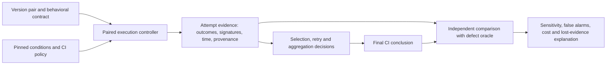

# Originality audit and new research ideas

**Date:** 2026-09-07  
**Purpose:** Reassess the originality of this project's existing and proposed contributions, then identify research worth pursuing beyond change-aware test prioritization.  
**Repository inspected:** `research/revival-2026`, HEAD `d967dbaaec257613c3e1f2440866801c71d0c00e`.  
**Scope:** Single-agent, read-only repository and literature investigation, plus this new document. No model training, CI replay, artifact restoration, or implementation was performed. The dataset counts below are new descriptive measurements, not new TCP experiments.  
**Status:** Research assessment and proposals, not an approved implementation plan or proof of novelty.

## 1. The conclusion I would act on

**Inference:** The repository's most valuable asset is its encounter with an uncomfortable measurement problem: predicting which test will fail is different from knowing whether a software change is unacceptable. Its data and negative results provide a reason to study that distinction. They do not yet demonstrate a solution.

The generic ideas are substantially occupied:

- Combining change relevance with test history has direct prior art.
- Studying how recurring and confounding failures affect TCP has direct prior art.
- Checking whether test maintenance preserves mutant detection has direct prior art, including an implemented tool.
- Using mutation testing to check the trustworthiness of CI acceleration also has direct prior art.
- Calling an investigator an agent, adding a graph, or using a contextual bandit does not establish a contribution.

**Proposal — my strongest direction:** Study **whether CI optimizations preserve sensitivity to intermittent defects**, while separately measuring their ability to suppress nuisance failures. Evaluate the actual decision process, including which tests execute, what retries retain, what quarantine hides, and what conclusion reaches the developer.

The question is:

> When a CI policy produces fewer red builds, how can we tell whether it eliminated false alarms or lost the ability to expose real defects?

This is a candidate research gap with a specific relationship to existing work, not a claim that nobody has asked the question. The defensible advance would be a controlled measurement method, executable evidence, and a demonstrated failure of an existing assessment method on a meaningful class of cases.

**Recommendation:** Begin with a small experiment that tries to falsify this direction. Do not begin by building an autonomous reliability engineer. If executable subjects cannot be obtained, the strongest immediate use of this repository is a rigorous audit of how failure labels and fault mappings change research conclusions.

## 2. Evidence basis and how to read this document

Statements use four categories:

- **Established evidence:** Directly inspected code, measured local data, or an attributable published result. A result reported in a repository document is identified as reported when it was not independently reproduced.
- **Inference:** A conclusion drawn from that evidence, with alternative explanations still possible.
- **Proposal:** An idea, experiment, design, or decision criterion introduced here.
- **Open question:** Something that the available evidence does not settle.

The routing documents [RESEARCH_STATE.md](RESEARCH_STATE.md), [TRAJECTORY.md](TRAJECTORY.md), [EXPERIMENTS.md](EXPERIMENTS.md), and [DECISIONS.md](DECISIONS.md) were read. At this snapshot they largely contain scaffolding. Their authoritative names do not mean the research state has been consolidated there.

The substantive evidence includes:

| Evidence | What it contributes | Limitation |
|---|---|---|
| [August consolidated findings](change-aware-tcp-findings-2026-08.md), added by `fd36568` | Airavata null, HBase/Hive reported comparisons, failure-structure interpretations | Several causal descriptions are stronger than their operational labels justify |
| [Change-aware pipeline](../../pipeline/), added by `820647e` | Actual feature construction, relevance scoring, temporal evaluation and persistence labels | Executable source does not imply every external input is present or every reported run is reproducible |
| Historical branches and commits, including `25eb6b7` | Trace of the Airavata T0 negative result and subsequent direction changes | Branch names and handoff narratives are not evidence of success |
| [Legacy framework](../../robust_tcp_framework.py), [embedding generator](../../embedding_generator.py), `FINAL6/` reports | Original modeling ambitions, repeated analyses, report structure | Numerous outputs are correlated products of the same subjects and choices |
| `datasets/*/exe.csv`, companion build and identity tables | Broad observed execution histories | No general counterfactual rerun, defect, or deployment oracle |
| [BugSwarm harvester](../../BugSwarm/BugSwarm_harvester.py) and LRTS adapter | Artifact-acquisition and normalization starting points | Availability and replay viability still require validation |
| [Adaptive program](ADAPTIVE_CI_RESEARCH_PROGRAM.md), [independent vision](INDEPENDENT_RESEARCH_VISION.md), [direction decision](RESEARCH_DIRECTION_DECISION.md) | Earlier proposals to challenge | These are proposals, not additional independent experiments |

Trace MCP was used for repository mapping, outlines, symbol inspection, and usage lookup. For example, it confirmed that `build_enhanced_dataset` calls `derive_history` in `pipeline/lrts_adapter.py`; the function's source was inspected. Direct file reads and Git remain the evidence when a trace lookup is absent or ambiguous.

**Established evidence:** A tracked-file inventory counted 720 files, including 20 Python files, 19 CSV files, 96 JSON files, 42 PDFs and 216 PNGs. This is distinct from both the trace index's smaller indexed set and the larger local, mostly untracked dataset holdings. File counts are inventory measurements, not study sample sizes.

### 2.1 What the wider local dataset scan actually establishes

**Established evidence:** All 25 populated `datasets/*/exe.csv` files were scanned with Python's standard-library CSV reader. Together they contain **15,689,348 records**, including **12,386 records with verdict `1` or `2`**. Observed verdict values were `0`, `1`, and `2`. Here `1` and `2` are combined as non-pass; no causal interpretation is assigned to that combination.

The scan counted rows, distinct recorded test IDs, distinct build IDs, non-pass rows, and each test ID's contribution to non-pass rows. These counts deliberately retain multiple jobs and recorded attempts. They are not deduplicated independent executions, verified faults, or failure episodes. The method does not establish that all eligible tests were observed.

Five illustrative results:

| Project | Records | Non-pass records | Tests with a non-pass | Share of non-passes belonging to five most frequent test IDs |
|---|---:|---:|---:|---:|
| Airavata | 11,484 | 1,173 | 33 | 22.17% |
| Log4j2 | 240,253 | 248 | 19 | 92.74% |
| Camunda | 472,765 | 2,112 | 268 | 9.04% |
| SonarQube | 5,635,027 | 1,798 | 139 | 40.38% |
| JMRI | 6,469,640 | 313 | 130 | 19.17% |

**Inference:** These subjects offer very different failure-concentration regimes. A story developed from Airavata should be tested against that variation. The low Airavata top-five share does not contradict a large co-failing block: a block can distribute failures across many test IDs.

**Limitations:** This statistic is concentration, not persistence, flakiness, recurrence probability, or causal fault structure. Unequal test exposure also affects it. The pooled non-pass rate would be dominated by the largest datasets; it is not an industry prevalence estimate. Complete per-project counts appear in Appendix A.

### 2.2 What the current TCP evidence supports

**Established evidence — reported result:** The August findings report Airavata's 30-cycle small-failure comparison as approximately 0.824 APFD for history versus 0.818 with T0, with p approximately 0.92. Preserve this negative result. It does not establish that better representations would necessarily succeed.

**Established evidence — code:** `regression_labels` in [step3_regapfd.py](../../pipeline/step3_regapfd.py) labels a failing execution positive when the next recorded execution of the same test also fails. It does not inspect an inducing commit, a bug fix, failure output, or matched base/head reruns. The last observation cannot receive a positive persistence label without a successor.

**Established evidence — reported results:** The findings report persistence-based APFD changes of 0.606 to 0.681 on 108 HBase cycles and 0.912 to 0.941 on 198 Hive cycles. This pass did not restore and independently rerun their full external artifacts. These are promising reported comparisons under a particular retrospective target.

**Inference:** The narrow defensible interpretation is that relevance may help rank a subset of persistent failures missed by history. Calling these failures genuine change-induced regressions is unsupported by the label alone. A continuing outage can persist; a real race defect can disappear on its next execution. Nondeterminism and change causation are separate properties.

**Established evidence — code:** `derive_history` uses strictly earlier cycles and rejects duplicate `(Name, Cycle)` pairs. That is a useful invariant. However, its clock uses build start information; an earlier-started overlapping build need not have completed before a later decision. Temporal validity requires observation availability, not just cycle ordering.

**Established evidence — code:** `compute_t0_column` documents an IDF corpus containing identities and changed paths from the whole supplied dataframe. A future causal experiment should freeze or incrementally fit that representation. This is an unsupervised future-information issue, distinct from leaking outcome labels.

**Inference:** The project's strongest reusable lesson is a need to validate the meaning and availability of evidence. It is not yet a law that history predicts flakes and relevance predicts regressions. History can predict a persistent product defect, and changes can cause new nondeterminism.

## 3. Originality: what survives comparison with prior work?

This is a targeted originality assessment, not an exhaustive systematic review or a patent search. Sources were checked on 2026-09-07. A failed search is not evidence of absence. Publication dates below come from the works, not search-engine crawl labels.

| Candidate claim | Closest relevant primary work | Assessment |
|---|---|---|
| Combine change similarity, failure history and duration for TCP | [Peng, Shi and Zhang, ISSTA 2020](https://sites.utexas.edu/august/wp-content/uploads/sites/5034/2020/08/ISSTA2020-tcp.pdf) explicitly evaluates hybrid IR/history/time methods and flakiness effects | **Occupied.** A new embedding or classifier needs an additional scientific contribution |
| Explain strong history baselines through confounding failures and first-failure difficulty | [Cheng et al., LRTS, ISSTA 2024](https://samchengcs.github.io/paper/cheng2024revisiting.pdf) examines these issues and alternative failure-to-fault mappings | **Occupied at the broad level.** A sharper, validated mechanism or methodological correction could still matter |
| Validate test refactoring by preserving mutant detections | [MeteoR, SBES 2024](https://sol.sbc.org.br/index.php/sbes/article/download/30422/30228/) and its [2025 expanded evaluation](https://doi.org/10.1007/978-3-031-94544-1_12) compare mutation outcomes before and after refactoring | **Direct overlap.** This substantially lowers the novelty of the previous generic recommendation |
| Assess whether CI acceleration loses defect-detection capability using mutants | [Zeng et al., MSR 2024, YourBase assessment](https://rebels.cs.uwaterloo.ca/papers/msr2024_zeng.pdf) compares accelerated and unaccelerated mutation outcomes | **Direct overlap, including with my initial idea in this pass.** Cannot claim the general assessment method as new |
| Account for flakiness in mutation-based assessment | [FlakiMe](https://arxiv.org/abs/1912.03197) studies controlled flakiness and its effects on mutation testing and repair | **Occupied broadly.** Must distinguish realistic intermittent defects from injected outcome noise |
| Repair flaky tests while retaining meaningful assertions | [FLEX, FSE 2021](https://www.cs.cornell.edu/~saikatd/papers/flex-fse21.pdf) studies assertion bounds and repeated execution in ML tests | **Substantial overlap.** Merely describing a stability-versus-sensitivity trade-off is insufficient |
| Use probabilistic reasoning to choose investigations | [Google's flake-aware culprit finding](https://research.google/pubs/flake-aware-culprit-finding/) | **Established family of techniques.** A wider action space alone does not demonstrate value |
| Learn selective testing while retaining exploratory observations | [Predictive Test Selection](https://arxiv.org/html/1810.05286v1) includes independent learning and broader testing mechanisms | **Established practice.** Random audit runs are not an invention of this project |
| Carry prior test evidence across changes | [Ekstazi](https://users.ece.utexas.edu/~gligoric/papers/GligoricETAL15EkstaziTool.pdf) and [difference verification](https://www.sosy-lab.org/research/difference/) | **Established foundations.** Evidence expiration needs a contribution beyond dependency invalidation |
| Optimize a CI gate's trade-off between incorrect blocking, missed risk and review load | [Cost-Sensitive Security Controls for Continuous Integration Pipelines, 2026](https://doi.org/10.1016/j.cose.2026.105124), inspected at publisher abstract level | **Adjacent recent work.** Its controlled security setting differs, but a generic cost-sensitive gate is not an empty space |

### 3.1 A correction to the earlier direction decision

**Established evidence:** MeteoR goes beyond aggregate mutation scores: it considers individual mutant states and killing-test information. The expanded work also discusses limitations. Therefore, neither “compare before/after mutation scores” nor “compare individual killed mutants” should serve as this project's central novelty claim.

**Inference:** [RESEARCH_DIRECTION_DECISION.md](RESEARCH_DIRECTION_DECISION.md) should be read as a dated proposal whose novelty assessment is revised here. It remains untouched for traceability. A maintenance-validation project could still become a useful replication, empirical extension, or tool, but the broad mechanism is not a strong new paper by itself.

**Established evidence:** The YourBase paper also considers nondeterministic behavior. In its inspection of 200 gap mutants, it separates such behavior from deterministic dependency problems and removes manually identified flaky tests from its analysis. It does not justify claiming that CI acceleration studies have ignored nondeterminism altogether.

**Proposal:** The narrower opportunity is to make validated intermittent defects an explicit subject of policy assessment, using paired clean/defective executions and policy interactions. Whether this adds enough beyond those works must be tested, not asserted.

## 4. The strongest new direction: measure what CI can still distinguish

### 4.1 Change the target from failure prediction to decision sensitivity

**Proposal:** Treat a CI configuration as a measurement procedure. Its result depends jointly on the program, tests, workload, environment, selection policy, retries, and aggregation. Evaluate whether it distinguishes an unacceptable behavior from a matched acceptable behavior.

For an explicitly scoped defect family, environment distribution and execution budget, define:

- `TPR`: probability the policy blocks or correctly escalates a defective version.
- `FPR`: probability it blocks or incorrectly escalates its matched acceptable version.
- `J = TPR - FPR`: a simple discrimination measure, alongside both component rates and cost.

`J` is the established Youden discrimination statistic, not a new metric invented here. It is useful because an always-red policy and an always-green policy both score zero. It is not sufficient for deployment decisions, where prevalence, severity and error costs matter. “Escalation” must be mechanically defined before evaluation; a vague warning cannot count as detection.

**Inference:** A flaky test may carry useful defect information. For example, a change that raises failure probability from 0.01 to 0.40 can be important even though failures remain intermittent. Conversely, a highly predictable failing test may carry little evidence about the present change.

### 4.2 A small calculation that explains the danger

**Illustration, not empirical evidence:** Suppose a test is selected with probability `q`. It fails with probability `p` on each independent attempt. A policy permits at most `r` total attempts, accepts any pass, and blocks only when all attempts fail. If selection is independent of those outcomes and this is the only blocking test:

`P(block) = q * p^r`.

Take acceptable-version failure probability `p0 = 0.05` and defective-version probability `p1 = 0.40`:

| Illustrative policy | TPR | FPR | J |
|---|---:|---:|---:|
| Always select, one attempt | 40.00% | 5.00% | 35.00 percentage points |
| Select 20%, allow three attempts | 1.28% | 0.0025% | 1.2775 percentage points |

The policy reduces nuisance blocks dramatically while also reducing defective-version detection by a factor of 31.25. That arithmetic is elementary, not a paper contribution. The comparison is not cost matched. Real retries can be correlated, share fixtures, alter timing, and leave visible warnings; real suites have multiple blocking tests. Measure those facts instead of treating this equation as an empirical estimate.

The important experimental consequence is that a deterministic mutant that fails whenever exercised may miss the failure mode: for `p = 1`, retrying does not attenuate its failure signal. A useful challenge set must include actual condition-dependent incorrect behavior, not merely random flips of test verdicts.

### 4.3 The contribution would have to be this specific

**Proposal:** An executable study that establishes all three of the following:

1. Some practical noise-reduction configurations lose sensitivity to validated intermittent defects under realistic operating conditions.
2. Existing simple assessments fail to reveal at least some of that loss, while a controlled paired assessment does reveal it without confusing unrelated failures with detection.
3. A modest, explainable policy change can recover useful sensitivity at a measured false-alarm and compute cost.

Showing that skipping every test misses bugs is not enough. Showing that random failure suppression suppresses failures is not enough. If all observed effects reduce to obvious skip rules caught by ordinary configuration checks, this should become engineering guidance rather than an inflated research claim.

### 4.4 A concrete future tool

**Proposal:** A local command accepts a candidate CI policy, a pinned component, and a small collection of validated fault challenges. It runs in isolation and returns a report such as:

> This retry/quarantine change reduces nuisance blocking. Under the tested conditions, it also lowers detection of the reproduced cache-invalidation defect. The assertion still fails on some attempts, but the final policy accepts the run. Keeping the initial evidence for escalation recovers detection at the reported cost.

Every numerical statement would link to actual attempts, conditions and a declared oracle. The tool does not certify arbitrary releases or intentionally introduce faults into production. Initially it does not need an LLM.

**Long-term possibility:** Periodically challenge CI policies against a rotating, withheld set of relevant defects, just as a measurement instrument is periodically calibrated. Such challenges provide evidence about specified defect families. They do not estimate all future escaped defects or establish global safety.

## 5. Seven ideas worth keeping, ranked by what to investigate

These are my synthesis proposals. “Candidate” means a plausible contribution to investigate, not verified historical priority. Ranking reflects expected research value and information gain, not certainty of success.

| Rank | Idea | Scientific value | Originality assessment | Feasibility now | Fastest informative test |
|---|---|---|---|---|---|
| 1 | Sensitivity of composed CI policies to intermittent defects | High | Candidate narrower extension of direct prior art | Medium-low: executable pairs required | Paired fault experiment in Section 6 |
| 2 | Certificates of TCP ranking ambiguity under unknown fault mappings | High | Candidate methodological extension; broad mapping sensitivity is established | High for exploratory analysis | Find whether one common admissible mapping reverses a headline comparison |
| 3 | An investigation benchmark with deliberately indistinguishable initial evidence | High | Candidate benchmark contribution; causal identifiability is established | Medium-low | Build two genuine causes with the same exposed prefix and a discriminating action |
| 4 | Preserve useful execution diversity when stabilizing tests | High | Candidate conditional extension of flake-repair work | Low-medium | Compare detection across held-out valid conditions before/after repair |
| 5 | Measure policy-induced forgetting across CI history | High | Candidate longitudinal extension of selective-testing work | Medium for simulation, low for causal field claims | Hide observations according to a policy, then test recovery from a new fault episode |
| 6 | Make evidence duplication and suppression visible in CI conclusions | Medium-high | Primarily engineering unless diagnostic consequences are established | Medium | Duplicate one observation across tool outputs and test confidence invariance |
| 7 | Predict the best intervention, not the most likely explanation | High | Established decision-theoretic idea; candidate CI evaluation gap | Low until action outcomes exist | Compare action-value prediction against diagnosis-class prediction at equal cost |

### Idea 2 — Know when the benchmark cannot determine a winner

**Proposal:** Produce a sensitivity certificate for a TCP comparison when several failed tests may correspond to the same fault. For each admissible failure-to-fault mapping, recompute the paired difference using the same mapping for both methods. Report whether the sign is robust, reversible, or unidentified.

The important step is not inventing another convenient mapping. It is bounding the conclusion across a stated set of mappings consistent with available evidence. Never choose a favorable mapping for one method and a different one for its competitor.

**Why this repository:** Airavata has large co-failing sets; `reg_apfd` counts labeled failing rows without establishing independent fault identities. The 25 histories support checking how frequently headline comparisons depend on that assumption.

**Closest overlap:** LRTS already evaluates different mappings. The candidate advance is a defensible set of constraints, efficient bounds, and an audit showing conclusions that selected mappings conceal. It is not merely adding another mapping to a table.

**First experiment:** On recoverable paired ranking outputs, contrast one-fault-per-failed-test, co-failure-based groupings, and bounds over plausible groupings. Use signatures or issue links to constrain a manually validated subset when recoverable. Treat unconstrained bounds that become vacuous as a result about data insufficiency.

**Could fail:** Correlation does not establish common cause, and the admissible set may be arbitrary. Without independently justified constraints, a reversal is an illustration rather than evidence that the original winner was wrong.

**Value:** A methods paper or audit tool that tells researchers which conclusions their dataset can support. This is the best fallback requiring mostly existing data.

### Idea 3 — A benchmark that rewards knowing what cannot yet be known

**Proposal:** Construct executable investigation pairs with identical initial exposed observations but different verified explanations. An isolated pass/fail history could come from a test-harness problem in one subject and a genuine intermittent product defect in another. A specified intervention, such as a controlled base/head comparison or fixture isolation, separates the cases.

A system should abstain or acquire that evidence. Confidently diagnosing from an intentionally identical prefix is a failure, even if its prose is persuasive.

**Scientific target:** Measure whether a controller chooses a discriminating action, not whether it memorizes correlations between dataset labels and project names. This operationalizes causal identifiability; the underlying principle is not new.

**Why this repository:** The old persistence label conflates explanations. The adapter and retrospective histories provide realistic shapes of incomplete observations, although they cannot supply unobserved action outcomes.

**First experiment:** Four matched scenario pairs, a maximum of two actions, a deterministic playbook and a probabilistic selector. Compare them with an LLM only later, using the same visible state and tools.

**Could fail:** Artificially hiding decisive information creates a puzzle rather than a realistic CI problem. Choose the initial information boundary from an actual CI interface and preserve all information that interface supplies. Synthetic pairs establish logical behavior, not prevalence or industrial effectiveness.

**Value:** A small, difficult benchmark for evidence-seeking behavior that cannot be solved solely by fluent explanations.

### Idea 4 — Repair the nuisance without shrinking the world being tested

**Proposal:** Treat execution diversity as something to preserve when repairing intermittent tests. A fixed seed, serialized execution, larger timeout or narrower input domain can make a test stable while removing exposure to a valid fault-triggering condition.

Measure the repair on a matrix of behavioral challenges and valid execution conditions. Accept stability gains only alongside evidence about retained detection. A practical design might use reproducible conditions for the fast gate and a small rotating diversity budget elsewhere.

**Closest overlap:** FLEX and earlier flaky-test research already address parts of this trade-off; controlled scheduling is also established. The candidate contribution is a validated preservation criterion across relevant conditions and an empirical demonstration that simpler acceptance checks misjudge real repairs.

**Why this repository:** Its binary treatment of non-passes obscures whether variability is informative. It supplies motivation, not the required repair artifacts or truth labels.

**First experiment:** Compare a documented flaky-test repair with its pre-repair version on the same production code, holding the challenge set fixed and separating intended requirement changes. Withhold some conditions when selecting the repair.

**Could fail:** Some removed conditions are invalid, obsolete or genuinely irrelevant. Preservation of every prior failure is not desirable. A behavioral contract and maintainer evidence must define which conditions remain in scope.

**Value:** A principled acceptance check for test stabilization, potentially useful for concurrent software and stochastic ML tests. Do not present ordinary mutant preservation as novel.

### Idea 5 — A CI policy can teach itself that its blind spots are safe

**Proposal:** Study the feedback loop in which selection or quarantine removes observations, the learned history changes, and later decisions become increasingly confident about poorly observed tests.

The interesting outcome is recovery after a new defect appears in a component that has become rarely observed. Measure the number of decisions and compute needed to detect it, including censored never-detected cases. A policy must distinguish a recorded pass from no execution.

**Closest overlap:** Exploration and independent learning runs are already part of predictive test selection. The candidate gap is the interaction among suppression, retained attempt history, retraining, and recovery from a validated distribution change.

**Why this repository:** It has large histories and models using prior outcomes. These support controlled missing-observation experiments. They do not reveal how developers would have changed code after different historical feedback.

**First experiment:** Use an observed historical stream as an explicitly fixed-world replay, hide outcomes under several policies, and compare forgetting and recovery. Then validate one recovered mechanism with prospective executable observations before making causal claims.

**Could fail:** Replay assumes the future stream is unchanged by earlier decisions. That assumption is false for some real workflows. A result confined to replay is a simulator finding, not proof of deployed behavior.

**Value:** A reason to budget observation for maintaining knowledge, rather than optimizing only the next build. Withheld fault challenges could eventually help allocate audits, but must never contaminate ordinary training histories.

### Idea 6 — Three agents repeating one log are still one observation

**Proposal:** Attach evidence identities and provenance to every conclusion. A stack trace, a failure-clustering tool and an LLM summary may all derive from the same test attempt. They must not be counted as three independent confirmations.

Define two invariants for an evidence-consuming system: duplicating or paraphrasing an observation should not increase confidence; discarding an earlier failure during retry aggregation should be explicit and reversible in the evidence record.

**Why this repository:** Multiple reports and feature families derived from the same execution history make evidence dependence easy to overlook. Existing build/test identity handling is a partial foundation, although investigative provenance is missing.

**First experiment:** Give the same controller an identical evidence set in three representations: deduplicated, duplicated, and duplicated through several tool summaries. Keep semantics and action budget constant. Measure incorrect confidence and decisions, not stylistic consistency.

**Novelty limit:** Provenance, data lineage, dependent evidence and metamorphic testing are established. A schema alone is product engineering. A scientific contribution requires demonstrated failures in real diagnostic systems and a method that improves decision quality.

**Could fail:** The invariants may be easily handled by ordinary deduplication. In that case, implement them eventually as engineering safeguards and do not make them the thesis.

### Idea 7 — Sometimes the best action is identifiable when the diagnosis is not

**Proposal:** Learn which intervention will improve the engineering decision, rather than first forcing a root-cause class. Two different causes may both justify isolating a fixture; an uncertain cause may still justify escalation. Conversely, knowing that a test is intermittent says little about which next run is useful.

**Scientific question:** Under equal data, tools and budget, is predicting the value of actions more robust across projects than predicting diagnostic categories and mapping them to actions?

**Closest overlap:** Value of information, decision-focused learning and active diagnosis already motivate this formulation. The contribution must come from a reproducible CI task and evidence of transfer, not the change of terminology.

**Why this repository:** Its relevance scores could identify candidate investigations, and its histories could supply priors. Its current CSVs cannot evaluate interventions they never observed.

**First experiment:** Only after obtaining the paired action table from Idea 3, compare a small action-value model, diagnosis-then-playbook, and a fixed playbook. Require equal costs and leave entire fault episodes out of training.

**Could fail:** One action is almost always best, action outcomes are inaccessible, or action labels encode future information. If a fixed playbook wins, adopt it and abandon the learned selector.

**Value:** The most credible eventual route back to adaptive CI investigation, after evidence quality and action heterogeneity are established.

## 6. The first experiment I would actually fund

**Proposal:** A ten-working-day feasibility study, capped at 80 CPU-hours and eight hours of artifact-selection effort, excluding manuscript writing. These are proposed limits, not resources consumed or authorized to execute by this document.

### Question and hypothesis

Can a paired assessment reveal a material loss of sensitivity to real intermittent defects that an ordinary one-run, binary outcome comparison mischaracterizes?

The null is useful: simpler assessments suffice, the extra distinction rarely changes a conclusion, or realistic executable cases cannot be obtained economically.

### Subjects and sourcing

Target **eight independent defect episodes from at least two projects**, including intermittent defects, stable defects as positive controls, and matched acceptable revisions. Fewer recovered subjects mean a feasibility report, not silently relaxed evidence requirements.

Start with the [YourBase study's published artifact reference](https://doi.org/10.5281/zenodo.10076515) as a reproducibility lead, then seek documented intermittent product defects and fixes in their upstream histories or recoverable CI artifacts. The artifact link is cited by the paper; download contents and replay viability were not verified in this pass. Its presence is not a claim that it supplies all required pairs.

BugSwarm or CI-Bench may provide useful environments and failure/fix candidates. A failing/passing pair is not automatically a matched regression experiment. IDoFT can provide flaky-test maintenance candidates but not a product-defect oracle. Airavata's historical failures can guide a search; the static tables alone are insufficient. Do not spend the whole pilot resurrecting ancient toolchains.

Enrol only when an independently inspected defect/fix, specification, or controlled semantic violation establishes the behavior being challenged. Record exclusions and restoration failures. Prefer real defects; report any seeded defect cohort separately. Never use random verdict flips as evidence of a real intermittent defect.

### Design

For each episode, execute the acceptable and defective versions under matched, contract-valid condition blocks. Randomize execution order and isolate state. Matching a seed does not guarantee identical concurrent schedules; record actual conditions and repeat.

Use a small factorial comparison:

- Full eligible component suite versus a frozen history/relevance selection rule.
- One attempt versus up to three attempts with the chosen retry aggregation semantics.
- No suppression versus a quarantine rule fixed using only pre-episode information.

That gives eight policy configurations. The initial selection/quarantine rules must not be fitted to challenge outcomes. Attempt 20 condition blocks per version/policy, subject to the global cap: eight episodes times two versions times eight policies times 20 blocks is 2,560 policy runs. Each run can contain multiple test attempts; budget all of them, plus setup. Enrol fast component-level subjects and report this selection limit. Stop at the cap rather than manufacturing completion through outcome-dependent exclusions.

This factorial design measures individual effects and interactions on the chosen probability scale; multiplication alone is not evidence of a special causal interaction. If reordering or retries alter state, execute the actual sequence. Replaying policy choices from a shared table is valid only for operations whose outcome invariance has been justified.

### Systems compared

1. A fixed deterministic CI configuration and documented triage rule.
2. The eight predeclared policy variants, including simple history/relevance selection where applicable.
3. A one-run binary accelerated/unaccelerated assessment as a simple assessment baseline, informed by the existing mutation-guided methodology.
4. The proposed paired repeated assessment, with acceptable-version controls and attempt provenance.

There is no LLM and no learned investigative controller in this pilot. The study asks whether a better measurement is necessary before asking whether a complex optimizer helps.

### Measurements

**Primary:** Episode-level TPR and FPR under each policy, and their paired changes relative to the fixed reference. Report `J` and its components; do not hide error asymmetry in a single number.

**Secondary:** CPU time, wall time, test attempts, final versus intermediate failure visibility, correctly supported escalation, and disagreement between the simple and paired assessments. Record which stage changes the conclusion. Count inconclusive/time-limited runs separately.

The statistical unit is the independent defect episode. Repeated attempts improve estimation within an episode; they do not create thousands of independent defects. Show per-episode results and uncertainty. Eight episodes across two projects cannot establish population-wide industrial prevalence.

### Continue / stop criteria

**Continue to a larger study** if at least three independent episodes across both projects show a reproducible, practically important sensitivity loss—provisionally at least ten percentage points—that a simple assessment misses or wrongly attributes, and acceptable-version controls support the distinction. Require at least one mechanism beyond trivially excluding the only relevant test. This is a pilot gate, not a statistical proof or publication threshold.

**Reframe as an empirical replication or engineering tool** if the problems are real but adequately explained and detected by existing assessments and simple checks.

**Stop this direction** if credible pairs are unrecoverable within the selection budget, effects depend on synthetic verdict noise, uncertainty overwhelms the distinction, or additional measurement rarely changes any decision. Do not rescue a negative result by immediately adding an LLM.

## 7. What to reuse, and what to stop carrying forward

| Existing component | Decision | Reason |
|---|---|---|
| Raw execution/build/test identity tables | **Keep; validate joins and semantics first** | Useful observations and subject screening; no action oracle |
| Historical features in `step2_baseline.py` and `derive_history` | **Adapt** | Useful priors; add availability-time discipline and distinguish missing from passing |
| T0 path/name relevance | **Keep as a cheap baseline; adapt fitting** | Candidate-action retrieval signal; not proof of causal impact |
| Precise path/package signals | **Keep negative evidence and simple baselines** | Failure on one setting does not rule out dependency analysis elsewhere |
| `lrts_adapter.py` | **Adapt after input validation** | Reusable normalization, identity and history contract |
| Prequential evaluation structure | **Keep the principle; validate clocks** | Essential for future policies, but cycle order alone is insufficient |
| `fault_structure_probe.py` | **Adapt** | Useful descriptive stratification; names such as chronic or regression must not become unverified causes |
| `step3_regapfd.py` | **Retire causal interpretation; retain retrospective diagnostic** | Its target is next-execution persistence, including censoring effects |
| Airavata null | **Keep prominently** | Prevents assuming relevance helps whenever a history model has room to improve |
| HBase/Hive comparisons | **Validate first** | Recover exact cohorts, outputs and configuration before extending their claims |
| Legacy embedding/model sweep | **Freeze as research history** | More representations do not resolve the target-validity problem |
| `FINAL6/` dashboards and reports | **Use as leads, not independent replications** | Trace runs back to inputs and code before aggregating conclusions |
| Previous vision/design documents | **Keep, with this correction linked in future work** | Preserve the change in judgment; do not silently rewrite earlier confidence |

**Inference:** The broad claim that structural signals are not worth building should be narrowed to the specific probes and subjects evaluated. Conversely, their weak results are not an invitation to build a larger graph system without a concrete unanswered question.

## 8. How this program could fool us

| Risk | Mitigation or explicit limit |
|---|---|
| Rediscovering existing work under a new name | Start from the direct overlaps above; write the precise delta before implementing |
| Treating any failing mutant run as detection | Use matched acceptable runs, verify signatures/behavior, and allow inconclusive attribution |
| Calling every intermittent failure harmless | Keep change causation, environment validity and outcome variability separate |
| Selecting only easy-to-reproduce defects | Publish the candidate roster, exclusions and restoration costs; limit generalization |
| Treating static tables as counterfactual observations | Use them only for factual descriptions or explicitly assumption-bound replay |
| Leaking future persistence, durations, vocabulary or completed results | Separate feature availability from retrospective labels; freeze representations and policy inputs |
| Counting jobs, retries or mutants from one issue as independent defects | Group and split by episode/project; use repetitions only for within-subject estimates |
| Assigning common cause from co-failure alone | Use uncertain mappings and externally validated constraints; retain unknown cases |
| Comparing policies at very different costs | Publish cost/error operating points and matched-budget comparisons where possible |
| Declaring fewer red builds a success | Report paired sensitivity and false alarms; do not optimize only green rate |
| Testing policies against a public challenge set they can memorize | Withhold fault families/conditions and distinguish challenge data from training observations |
| Mistaking a plausible explanation for a supported diagnosis | Require evidence identities and predeclared behavioral oracles; no prose-quality primary metric |
| Generalizing controlled noise to real defects | Separate synthetic outcome noise, seeded semantic faults and historical product defects |
| Inventing an interaction through the metric scale | Predeclare the estimand and show component effects; report scale dependence |
| Confusing warning visibility with blocked release or prevented incident | Define each outcome separately; this study measures CI behavior, not production incidents |

## 9. My ownership decision

**Proposal:** I would spend the next research cycle on two sequential steps, with an explicit stop between them:

1. Complete the small fault-mapping and evidence-validity audit using existing, recoverable outputs. This provides a useful result even if the larger idea fails and prevents building on unverified regression labels.
2. Fund the bounded paired policy-sensitivity pilot. Continue only if it reveals a real assessment gap beyond the direct prior art.

If the second step succeeds, the next system should initially recommend a small action—retain an earlier failure, rerun under a discriminating condition, compare a base revision, or abstain—and demonstrate that the action improves an engineering decision at a measured cost. Only then investigate learned selection or an LLM investigator.

I would not build a multi-agent platform, new embedding stack, unrestricted diagnostic planner, autonomous release gate, or full CI digital twin now. Those are expensive ways to postpone discovering whether the evidence supports useful decisions.

**Open questions to carry forward:**

- Which real intermittent defects can be reproduced without changing the behavior we are trying to assess?
- Can a paired control separate nuisance behavior from defect sensitivity at an affordable number of executions?
- Which apparent policy effects survive project, environment and fault-family changes?
- Does a meaningful class of cases defeat existing simple assessments, or is this principally a replication opportunity?
- Can a team state acceptable error/cost trade-offs without pretending that all defects have equal consequences?
- Do different episodes require different next actions, or is a short deterministic playbook sufficient?

**Recommended next action:** Reproduce one real, independently understood intermittent defect and its acceptable counterpart in an isolated component environment. Compare two actual retry/aggregation policies while retaining every attempt. If that one example cannot distinguish nuisance reduction from sensitivity loss with credible evidence, do not build the larger system.

**Long-term vision:** A CI service that can show what it currently knows how to detect, what its optimizations have made harder to detect, and which affordable observation would resolve an important uncertainty. Its value would come from warranted evidence and useful decisions. Autonomy would be optional.

## Appendix A. Full local execution-table scan

**Established evidence, 2026-09-07.** Each row refers to `datasets/<project>/exe.csv`. Builds and tests are distinct IDs within that file. “Non-pass builds” means builds containing at least one recorded verdict `1` or `2`. “Top-five share” uses non-pass row counts, not test failure rates adjusted for exposure.

| Project | Records | Test IDs | Build IDs | Non-pass records | Non-pass builds | Top-five share |
|---|---:|---:|---:|---:|---:|---:|
| Angel-ML@angel | 10,133 | 46 | 308 | 442 | 125 | 42.76% |
| apache@airavata | 11,484 | 55 | 236 | 1,173 | 84 | 22.17% |
| apache@curator | 59,697 | 132 | 517 | 126 | 104 | 65.08% |
| apache@logging-log4j2 | 240,253 | 689 | 441 | 248 | 232 | 92.74% |
| apache@rocketmq | 97,734 | 219 | 536 | 115 | 57 | 57.39% |
| apache@shardingsphere | 833,541 | 1,020 | 1,049 | 1,364 | 152 | 54.55% |
| apache@sling | 265,459 | 283 | 1,403 | 816 | 698 | 81.74% |
| b2ihealthcare@snow-owl | 13,056 | 53 | 277 | 116 | 59 | 51.72% |
| camunda@camunda-bpm-platform | 472,765 | 1,021 | 822 | 2,112 | 175 | 9.04% |
| cantaloupe-project@cantaloupe | 67,108 | 241 | 450 | 175 | 71 | 24.57% |
| CompEvol@beast2 | 27,083 | 71 | 415 | 266 | 116 | 72.93% |
| eclipse@jetty.project | 26,439 | 387 | 192 | 171 | 151 | 76.61% |
| eclipse@paho.mqtt.java | 14,057 | 50 | 378 | 87 | 78 | 75.86% |
| eclipse@steady | 54,689 | 171 | 675 | 65 | 52 | 66.15% |
| EMResearch@EvoMaster | 59,155 | 134 | 583 | 354 | 144 | 32.77% |
| facebook@buck | 561,294 | 800 | 846 | 1,128 | 131 | 33.78% |
| Graylog2@graylog2-server | 404,457 | 262 | 3,668 | 280 | 125 | 78.57% |
| jcabi@jcabi-github | 140,526 | 199 | 809 | 169 | 77 | 68.05% |
| JMRI@JMRI | 6,469,640 | 4,529 | 1,481 | 313 | 95 | 19.17% |
| optimatika@ojAlgo | 34,438 | 146 | 254 | 82 | 73 | 89.02% |
| SonarSource@sonarqube | 5,635,027 | 2,641 | 4,286 | 1,798 | 300 | 40.38% |
| spring-cloud@spring-cloud-dataflow | 47,094 | 166 | 408 | 278 | 89 | 35.61% |
| thinkaurelius@titan | 17,331 | 129 | 384 | 118 | 61 | 50.85% |
| yamcs@Yamcs | 58,101 | 160 | 504 | 192 | 73 | 39.58% |
| zolyfarkas@spf4j | 68,787 | 168 | 587 | 398 | 278 | 57.54% |

Reproduction procedure: enumerate those 25 paths; read each file with `csv.DictReader`, UTF-8 with optional BOM handling; count all rows; maintain sets of `test` and `build`; count non-pass rows using exact string membership in `{1, 2}`; accumulate those rows by test ID; divide the sum of the five largest counts by the file's non-pass total. Do not substitute the wider `dataset.csv` tables or cleaned legacy report cohorts. No source data were written by this scan.

## Appendix B. Literature checks that would precede a novelty claim

The strongest direct overlaps were found with focused queries including `test code refactoring mutation behavior preservation`, `continuous integration decision mutation testing`, and `mutation testing retries flakiness`. Primary papers and author/publisher pages were preferred. Vendor pages and broad search results were used as discovery leads, not as evidence of scientific superiority.

Before proposing a paper as novel, complete citation chasing around MeteoR, the mutation-guided YourBase study, FlakiMe, FLEX, and LRTS. Search specifically for repeated paired mutation assessment, statistical fault sensitivity, flaky-regression coexistence, and joint effects of selection/retry/quarantine. Check released artifacts against the intended experiment. The search in this pass establishes important overlaps; it does not establish that the narrower proposal is unoccupied.

The appropriate novelty sentence, until then, is: **“We propose to investigate a specific extension whose empirical value and distinction from prior work remain to be demonstrated.”**

## Appendix C. Input fingerprints for the new descriptive scan

SHA-256 hashes were computed from the same local CSV bytes scanned in Appendix A. Paths below are relative to `datasets/`. These fingerprints identify the observed inputs; they do not establish their upstream provenance or license.

| Input | SHA-256 |
|---|---|
| `Angel-ML@angel/exe.csv` | `249fb78bfe8336a60e505c890dfd336610b1ae390f0230daf0c62c54814872d8` |
| `apache@airavata/exe.csv` | `0f99bfac6790243f36f09f29cb824d34507e272f88ecb0123db48b4f54479625` |
| `apache@curator/exe.csv` | `82622fe5cd9fcc94f04ba77c6a813538e646767ade212fd250f9f17ea865165d` |
| `apache@logging-log4j2/exe.csv` | `5e497bb5349f6586625a026347dce72071ca7404c7b8683fc42e58c208c4a0df` |
| `apache@rocketmq/exe.csv` | `10130c9b11d67c67ba18c8b3b455e507a9a379f0a3d769b3a5f15f62da0cc854` |
| `apache@shardingsphere/exe.csv` | `0143d1c9c5c7d6db991e12989213e0aaaa79a1d47bce7fe137acb29cc6ac3117` |
| `apache@sling/exe.csv` | `14292ef46afd42a2e00234e7b6c1cff7ea87ea3ff345b453a4907f8d8615c076` |
| `b2ihealthcare@snow-owl/exe.csv` | `61ce39f894f3bb86518fd84b69b9260ec9a37943a905afc178822784747d4dd4` |
| `camunda@camunda-bpm-platform/exe.csv` | `52a2421b872d3ce9270bcf4743a12f614c2cb3551bf40763b65b7a30f991710e` |
| `cantaloupe-project@cantaloupe/exe.csv` | `f9555fbc628c61f4f418a3d570dfb684f8ec4d8877ed09d5344d83993878b452` |
| `CompEvol@beast2/exe.csv` | `d7b56c69dee3465bf364ed6b6dbb3829c48cca858a43856ccc1684e8c7c42f98` |
| `eclipse@jetty.project/exe.csv` | `6abb5d9040be41f34d0352f5eb9706e27fa2a960d7f5ab2f45d62e021763ed6c` |
| `eclipse@paho.mqtt.java/exe.csv` | `d66c6aa577f9764f07f1c96cb8ca8f3fcf077caa08c1e80fa3236172180eb9f6` |
| `eclipse@steady/exe.csv` | `2573c878efd699d99146da801718dcc85cb6b7ab003a082346af6e7fbce15652` |
| `EMResearch@EvoMaster/exe.csv` | `38dc22cba164b2d9f6e143fd1f912ead0442263086cb318a589f383a5b57037c` |
| `facebook@buck/exe.csv` | `9e1f0b723d3ebb4f2e98853a96f9eeae7ffa67852ac0cfc39bf64086352780ce` |
| `Graylog2@graylog2-server/exe.csv` | `a750d7c12cdc59cea0d791d03328c31e2374295b1cf0a15284575afaedf8ff4c` |
| `jcabi@jcabi-github/exe.csv` | `6cf16884e9572d2ad413a98c2906866b856fdd5e68268319f69026403413b581` |
| `JMRI@JMRI/exe.csv` | `38005fb6a075329b0431bfcaa8f9e64b4b354a63e66c9ac0bc4de83888087ff4` |
| `optimatika@ojAlgo/exe.csv` | `bcc7668804f3eaa5af34051f13cfe15cab8841ef3f97064aec4bbb85c27277ca` |
| `SonarSource@sonarqube/exe.csv` | `9354c37437ace378826059b1d110ee9a6730b86f2652a40c4f31fe01d4a5de13` |
| `spring-cloud@spring-cloud-dataflow/exe.csv` | `872cf1a33f6461ab18201f0c723f59b3189f4164f7aff0fbe3ca9a797fcd2a42` |
| `thinkaurelius@titan/exe.csv` | `7e658e2a9cad4034a2580e812aa530430ba13a1f850d526ddf083bf08f27b95a` |
| `yamcs@Yamcs/exe.csv` | `8c9e0b78b9ee60c54be7f4d62efc7712420a49baf00a5c4c6951bbfedbd41860` |
| `zolyfarkas@spf4j/exe.csv` | `b4fcfdb5e0d7f01e9353a2ee8171c04d8a13c62ca956f58310b1367ec3614a43` |
